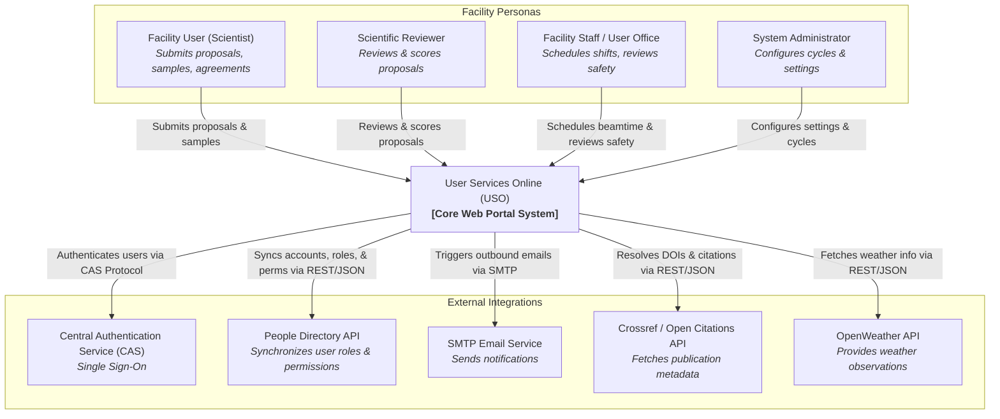
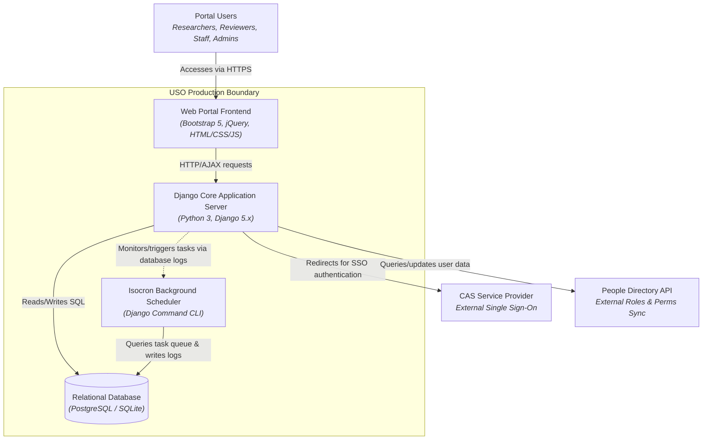
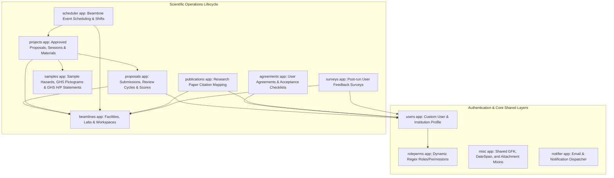

# System Architecture

User Services Online (USO) is a modular, high-performance information management portal developed by the Canadian Light Source (CLS). It is designed to administer operations at a large-scale scientific research facility, managing user proposals, experiments, sample safety approvals, scheduling shifts on beamlines, tracking research publications, and compiling user feedback surveys.

This document provides a comprehensive analysis, visualization, and documentation of the USO system architecture, serving as a primary reference for system architects, developers, and onboarding engineers.

---

## 1. System Context Diagram (C4 Level 1)

This diagram shows the high-level boundary of the USO application, how different personas interact with it, and the external dependencies integrated into the platform.



---

## 2. Container Diagram (C4 Level 2)

This diagram breaks down the technology choices, service boundaries, and data storage solutions within the USO ecosystem.



---

## 3. Modular Monolith Component Directory (C4 Level 3)

USO is architected as a **decoupled modular monolith** inside a single Django project. Domain boundaries are strictly separated into discrete Django applications placed under the `apps/` directory.

The diagram below illustrates how components interact, showing the flow from authentication through proposal submission, project creation, sample safety clearance, scheduling, and finally to publication mapping.



### Module Breakdown

Here is a detailed catalogue of the 14 custom applications defined within `apps/`:

| Module | Core Purpose | Primary Models / Classes | Key Integrations |
| :--- | :--- | :--- | :--- |
| **`users`** | Manages custom user authentication profiles, contact details, and institutional directories. | `User`, `Institution`, `Address`, `Country`, `Region` | Syncs user details and institutional data with the external "People Directory" API. |
| **`roleperms`** | Implements fine-grained role-based access control (RBAC) extending Django permissions. | `RolePermsUserMixin` | Validates roles & permissions synchronized from the "People Directory". |
| **`proposals`** | Coordinates the entire research proposal submission and peer review lifecycle. | `Proposal`, `Submission`, `ReviewCycle`, `Reviewer`, `ReviewStage`, `Review` | Dynamic form definition via `django-dynforms`. |
| **`projects`** | Holds approved proposal states, experimental sessions, safety materials, and allocations. | `Project`, `Material`, `Session`, `LabSession`, `Allocation`, `ShiftRequest` | Links projects back to cycles, teams, and beamlines. |
| **`beamlines`** | Defines structural models for the facility's experimental setups and physical footprint. | `Facility` (beamline/sector/department), `Lab`, `LabWorkSpace`, `Ancillary` | Tracks spot size, flux, and support details. |
| **`samples`** | Controls experimental sample declarations, chemical hazards, and GHS indicators. | `Sample`, `Hazard`, `HStatement`, `PStatement`, `Pictogram`, `SafetyPermission` | Evaluates sample hazard classes against safety guides. |
| **`scheduler`** | Governs the planning grids, shift durations, operating modes, and allocation bounds. | `ShiftConfig`, `Schedule`, `Event`, `Mode`, `ModeType` | Combines with `projects` allocations to schedule runs. |
| **`agreements`** | Handles user legal/safety acknowledgments, tracking digital acceptance signatures. | `Agreement`, `Acceptance` | Records timestamp, signature hash, and remote IP. |
| **`notifier`** | Manages reusable communication templates and asynchronous email transmissions. | `Notification`, `MessageTemplate` | Supports background queueing for notification delivery. |
| **`isocron`** | Scheduled background task execution wrapper mimicking cron logs. | `BackgroundTask`, `TaskLog` | Runs loops for cleanup, syncing, and reminders. |
| **`publications`** | Monitors publication listings originating from experiments conducted at the facility. | `Publication`, `Journal`, `JournalMetric`, `FundingSource`, `ArticleMetric` | Queries Crossref / Open Citations API. |
| **`surveys`** | Gathers operational feedback from user groups at the close of their experiment runs. | `Feedback`, `Rating`, `Category` | Rendered via `django-dynforms` custom templates. |
| **`weather`** | Caches local weather patterns to aid in monitoring local outdoor setups. | `Weather` | Periodically hits OpenWeather API. |
| **`misc`** | Offers centralized utility tools, Generic Foreign Key (GFK) mappings, and activity logs. | `Clarification`, `Attachment`, `ActivityLog`, `DateSpanMixin` | Core mixin dependencies across all apps. |

---

## 4. Key Architectural Design Patterns & Features

### 1. Extended Role-Based Access Control (RBAC) System
Unlike standard Django apps which rely on many-to-many lookup tables for permissions (`auth_user_groups`), USO stores list arrays representing role hierarchies directly on the custom `User` model using database JSON fields:
- Core mixin: `RolePermsUserMixin` (located in [models.py](file:///<project>/apps/roleperms/models.py))
- Permission verification uses regular expressions (`roles__iregex`) to evaluate cascading role templates (e.g., matching wildcard facility roles like `staff:*` or specific facility levels like `staff:contracts`).
- Check helpers include custom class view decorators: `AdminRequiredMixin`, `StaffRequiredMixin`, and `OwnerRequiredMixin` (found in [views.py](file:///<project>/apps/roleperms/views.py)).

### 2. Dynamically Discovered Applications Routing
To prevent monolithic route listings, the primary URL dispatcher [urls.py](file:///<project>/apps/usonline/urls.py) implements the dynamic iterator utility `iterload` (from [utils.py](file:///<project>/apps/misc/utils.py)). 
- This automatically searches settings `INSTALLED_APPS` directories for any modules exposing `api_urls.py` or `user_urls.py`, auto-routing them onto namespaces `/api/v1/` and `/user/` respectively.

### 3. Deep Core Framework Dependencies
USO heavily leverages specialized custom libraries written specifically for the system's modular architecture:
* **`django-dynforms`**: For dynamic questionnaire definition. Proposals, reviews, and surveys do not have static hardcoded HTML inputs; instead, their schemas are defined dynamically in database models and mapped to forms.
* **`django-itemlist`**: Standardizes all listing dashboards with uniform search bars, pagination, dynamic CSV export links, and filter lists.
* **`django-crisp-modals`**: Wraps Bootstrap 5 inputs inside floating overlay dialog fields without requiring manual JavaScript trigger implementations on standard actions.
* **`django-reportcraft`**: Facilitates advanced database reports and SQL aggregation queries (such as counting shifts or mapping age groups).

---

## 5. Developer Onboarding Quick-Start

### Local Environment Setup
To get a local instance of USO running, execute the following steps in your terminal:

```bash
# 1. Clone the repository and navigate into it
git clone https://github.com/michel4j/uso.git
cd uso

# 2. Set up a Python virtual environment and activate it
python -m venv .venv
source .venv/bin/activate

# 3. Install packages
pip install -r requirements.txt

# 4. Prepare local folder layouts, configuration templates, and database
# This script copies the settings template, makes static directories, and runs migrations
./deploy/prepare-instance.sh

# 5. Populate local development database with Faker-generated data
python deploy/generate-data.py

# 6. Start the local server
python manage.py runserver
```
The application will be accessible at: `http://localhost:8000/`.

---

## 6. Recommended Starter Tasks for New Developers

* **Level 1 (Day 1 - Docs & Exploration):**
  * Run the server locally and create a local user login.
  * Explore the Django Admin interface at `/admin/` and review the structure of `agreements` and `beamlines` models.
  * Correct typos or improve field help-texts on a sample form.
* **Level 2 (Week 1 - Bug Fixes & Tests):**
  * Check the logs in the background task processor (`isocron`) and verify task success logs.
  * Add a unit test verifying permissions matching in [tests.py](file:///<project>/apps/roleperms/tests.py).
* **Level 3 (Week 2 - Small Enhancements):**
  * Add an API field to the `beamlines` details serializers in `beamlines/api_urls.py`.
  * Style a specific modal or table using customized SCSS overrides.
