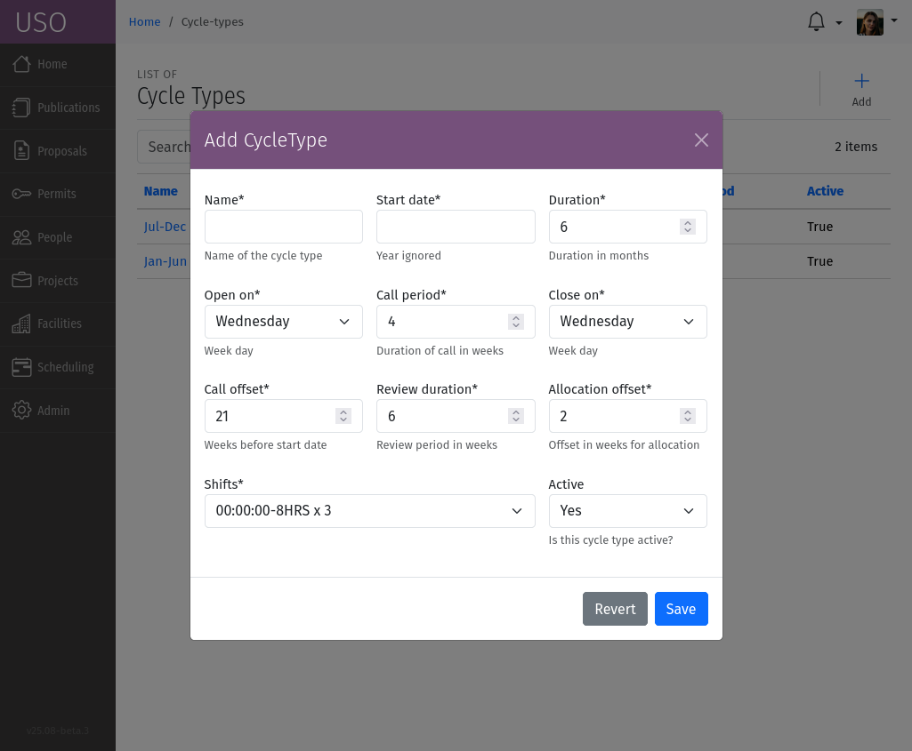
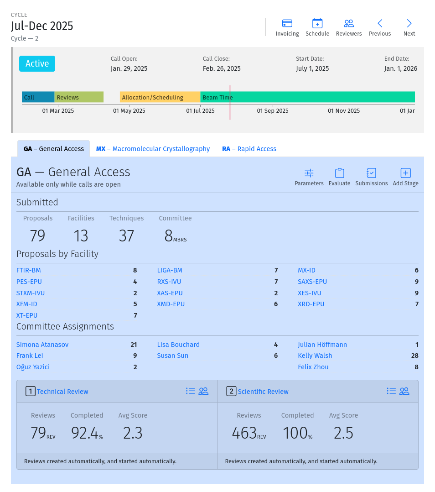

Managing Cycles
===============

The USO system operates on a cycle-based model. Each cycle is a defined period during which experiments can be
scheduled and performed. Cycles also include information about dates of activities that happen prior to the
start of the cycle, such as calls for proposals, reviews and allocation. By default there are two 6-month cycles per
year. However, different cycle types can be created, with customized options dates and durations. The management of
cycles is crucial for organizing the proposal submission, review, and allocation processes. This section provides an
overview of how cycles are managed within the USO system.

Cycle Types & Cycles
--------------------
Cycles are defined by their type, which determines the start date within the year, duration in months, and other
details such as, how early to open the call, the duration of the call, the duration of the review period, etc.

In essence, a cycle type defines the parameters for a calculating the dates for new Cycles. The cycle type
encapsulates the period of the year during which the derived cycle is active. For two 6-month cycles
per year, define two cycle types, one for each cycle, each with a 6-month duration. For a single cycle per year,
define one cycle type, with a duration of 12 months. For a single cycle every two years, define one cycle
type with a duration of 24 months.

.. note::
   Only one cycle of a given type can start in a given year, and no two cycles of the same type can overlap.
   The duration of a cycle should not be confused with the duration of a project. Projects can be valid for multiple
   cycles.

    A screenshot of the Cycle Type form.

Cycle types can be managed by User Office Administrators through the :menuselection:`Admin --> Cycle Types` section.
Each cycle type is characterized by the following attributes:

- **Name**: A unique identifier for the cycle type.
- **Start Date**: The Start date of the cycle. The year part of the date is ignored, and the cycle will start
  on the same month and day.
- **Duration**: The duration of the cycle in months.
- **Open on**: The week day on which to open the call.
- **Close on**: The week day on which to close the call.
- **Call Period**: The duration of the call for proposals in weeks.
- **Call Offset**: The number of weeks before the start of the cycle when the call for proposals should be opened.
- **Review Duration**: The duration of the review period in weeks.
- **Allocation Offset**: The number of weeks between the end of the review period and the allocation date. Usually
  this time is used for committee meetings and finalizing the scoring of submissions.
- **Shifts**: The number :ref:`configuration <shift-config>` of shifts for the cycle Schedule.
- **Active**: A flag indicating whether the cycle type is currently active. Inactive cycle types are not used to create
  new cycles, but can be used to view historical data or for reference.

.. note::
   Cycles are created automatically from all active Cycle Types by :ref:`Background tasks<background-tasks>`. Once
   created, every cycle is associated with a :ref:`Schedule <schedule>` spanning the same period.

Viewing Cycles
--------------
To view the list of cycles, navigate to the :menuselection:`Proposals --> All Cycles` section of the USO system menu.
This will display a list of all cycles, including their start and end dates. Select a cycle from the list to access
the Cycle details page.  The current cycle is also available through :menuselection:`Proposals -> Current Cycle`.

Cycle Details
-------------
The Cycle details page provides comprehensive information about the selected cycle, including its start and end dates,

    A screenshot of the Cycle details page showing the cycle information and tabs for managing review tracks,
    review stages, and reviews.

At the top of the page, you will find the cycle information, including the cycle type, start and end dates, and a
timeline of important dates related to the cycle, such as the call for proposals, review period, allocation date, etc.
Below the cycle information, there are several tabs corresponding to the available review tracks.

Cycle States
------------
The cycle can be in one of the following states:

- **Pending**: This is the state the cycle before the call opens.
- **Open**: The cycle is open for proposals, and the call for proposals is active.
- **Assigning**: The cycle is in the process of assigning reviews to submissions. This state immediately after call
  closes.
- **Review**: The cycle is in the review phase, and proposals are being reviewed.
- **Evaluation**: This is the period between the end of the review period until allocation.
- **Scheduling**: The cycle is in the scheduling phase. Allocations are complete and beamtime is being scheduled. This is
  the state after allocation and before the start of the cycle.
- **Active**: The cycle in the operation phase and beam time is being used.
- **Archive**: The cycle is complete. This is the state after the end of the cycle.

.. note::
   The cycle state is automatically updated by :ref:`Background tasks <background-tasks>`. The state of the cycle
   determines which actions are available on the Cycle details page. The list of tools available will change between
   states to reflect the availability of actions on the cycle.

