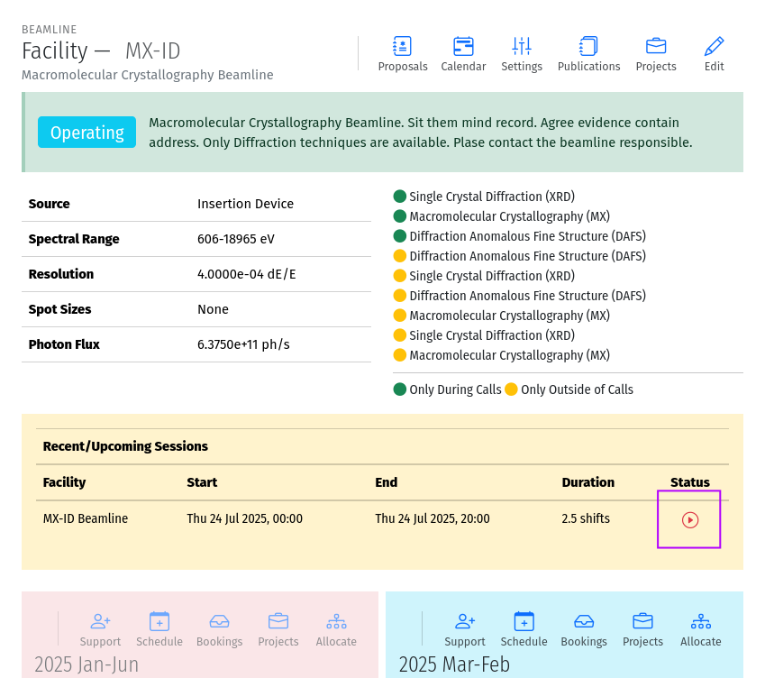
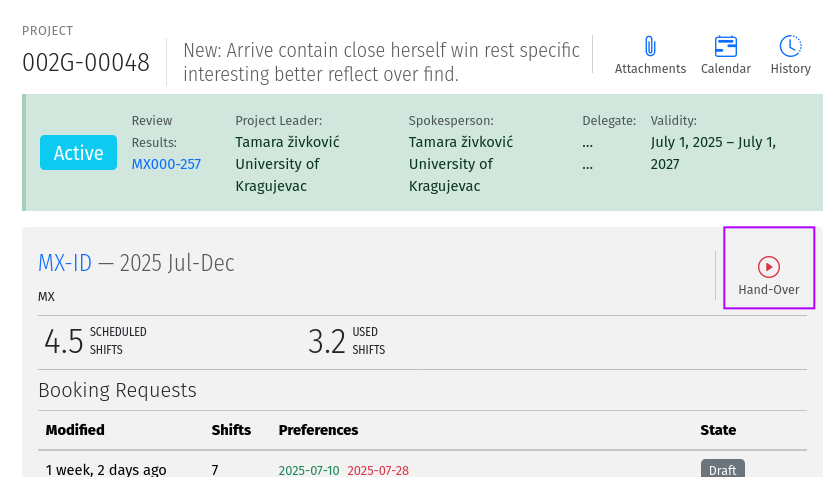
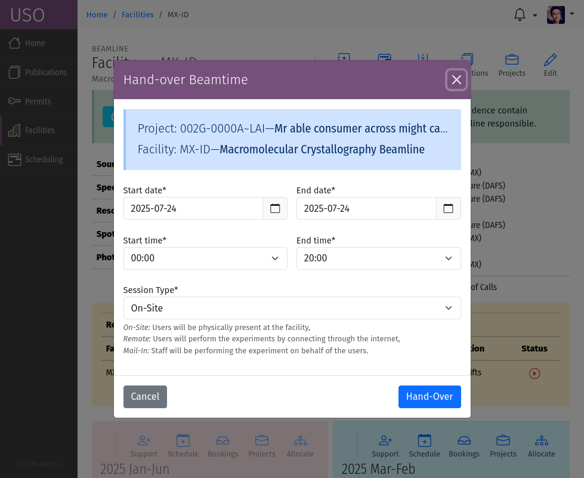
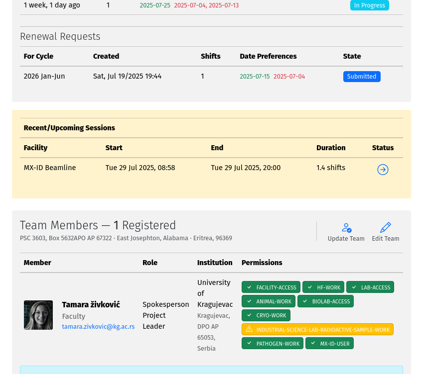
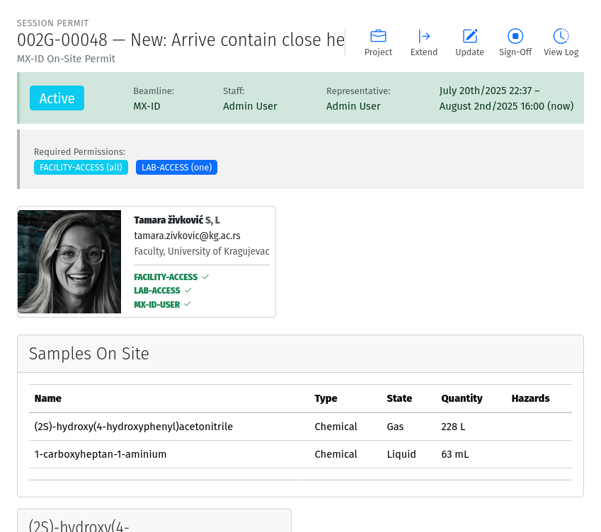

Experiments
===========

Experimental sessions are contiguous periods of beam time during which a project is using a beamline or facility.
Sessions can be created from scheduled beamtime or manually by facility staff using tools on the project page.

A valid session requires a few steps to establish:

- **Hand-Over**: An action performed by beamline staff to hand over a beamline to a specific project
  for a specific time slot. A hand-over is required before user experiments can start.
- **Sign-On**: An action performed by the spokesperson to assume responsibility for the beamline during
  the prescribed period. The sign-on is only possible after a hand-over.

.. note::
   A successful sign-on results in a valid electronic permit to use the beamline which will remain valid
   until signed-off or terminated. Sessions can be terminated at any time by beamline or Health & Safety staff.

For scheduled beamtime, the hand-over can be initiated by clicking the :icon:`bi bi-play-circle text-danger; Hand Over` tool
next to the scheduled session on the Recent/Upcoming Sessions list of the Facility Details page.

   A screenshot of the hand-over tool on the Facility Details page.

The :icon:`bi bi-play-circle text-danger; Hand Over` tool is also available on the project page under the facility allocations
section, allowing you to hand over the beamline for a specific project and time slot even if the session is not
previously scheduled.

   A screenshot of the hand-over tool on the Project page.

Activating the hand-over tool, will open a modal dialog where you can set the session
parameters, such as the start and end time, and the session type. If activated from a scheduled beam time, the
parameters will be pre-filled with the scheduled session details. However, you can change the start and end time to
extend or shorten the session as needed.

   A screenshot of the hand-over form.

The session type can be set to either:

- **On-Site**: For experiments conducted by users present physically at the facility.
- **Remote**: For experiments conducted remotely, where users are not physically present at the facility.
- **Main-In**: For experiments conducted by facility staff on behalf of users.

The session type is important for determining the required qualifications of session participants. For example,
users physically at the facility may need additional training requirements such as facility evacuation procedures, etc
that are not required for remote users.

Once the hand-over is completed, the session will be created and the spokesperson can sign-on to the session. The
session entry in the Recent/Upcoming Sessions list will change to display a :icon:`bi bi-arrow-circle` tool. Clicking
this tool will take you to the session  page where you can manage the session. The session list is available both
on the project page, for project specific sessions, and on the facility details page, for facility-specific sessions.

   A screenshot of the sessions table on the project page follow the links to sign-on or view the session details.

The session page provides comprehensive information about the session, including its start and end times, and required
qualifications for the session participants. The session page also includes a toolbar with several icons that allow you
to perform actions on the session. Sessions can be in one of the following states:

- **Ready**: The session is handed-over but the users have not signed-on yet. It can be deleted by beamline staff
  while in this state.
- **Active**: The session is active, and the spokesperson has signed-on. The session can no longer be deleted, but it
  can be extended or terminated by User Office Administrators or Health & Safety Staff. Beamline staff can also
  extend the session duration at any time while the session is active, or sign-off to end the session.
- **Complete**: The session has been terminated by beamline staff or Health & Safety staff. The session is no longer
  active.

   A screenshot of an active beam time Session page showing the session information and tools for managing the session.

.. note::
   Sessions are terminated automatically by the system if the spokesperson does not sign-off a pre-defined
   period after the scheduled end of the session. To allow users to continue using the beamline, staff must extend
   the session duration before the scheduled end time. This is to ensure that sessions are not left open indefinitely.
