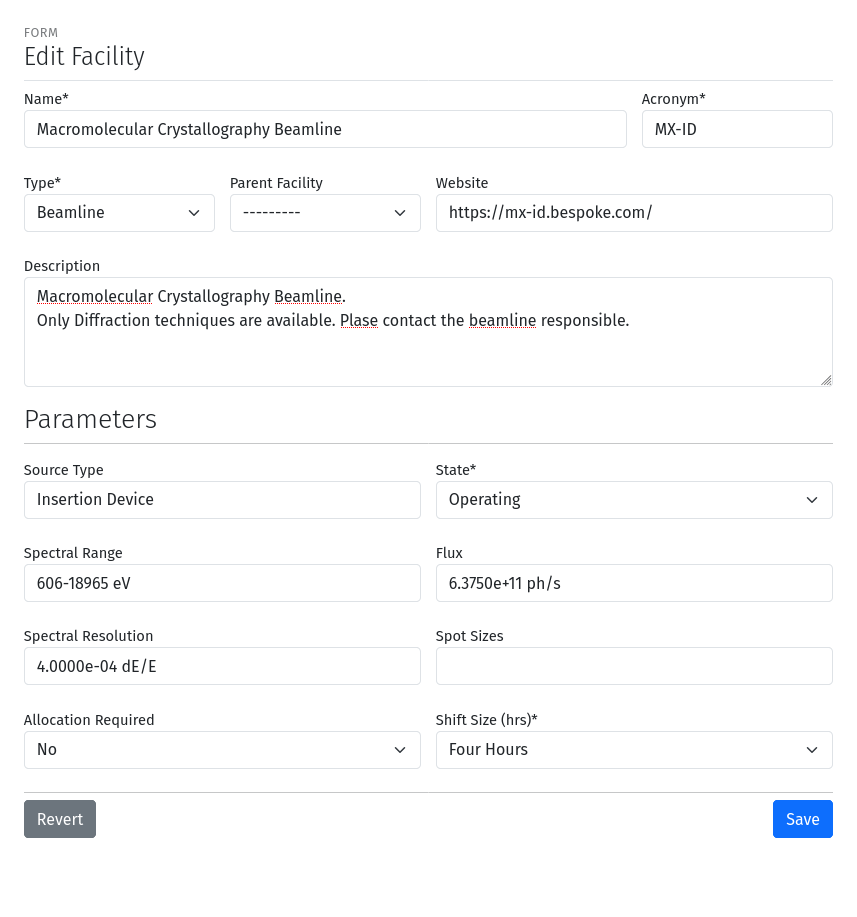
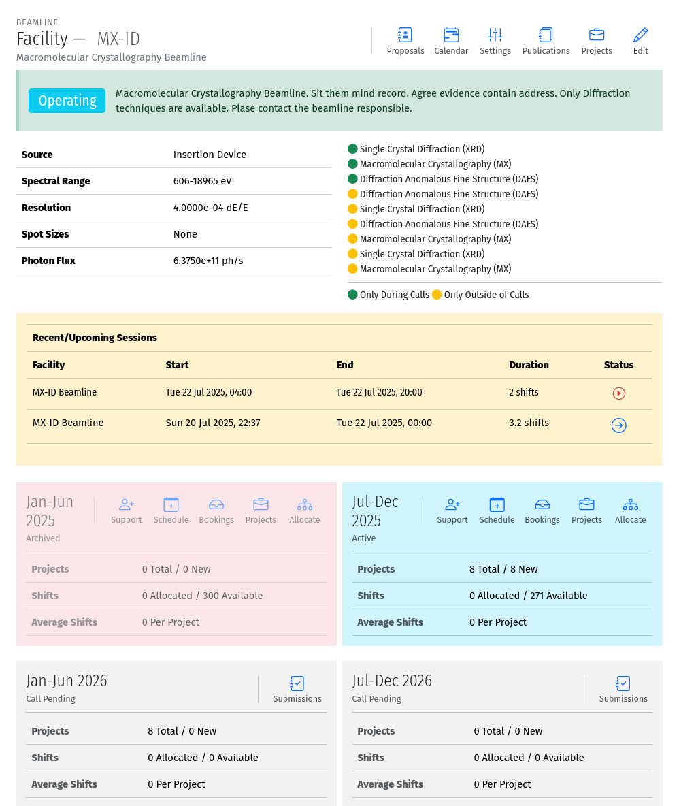
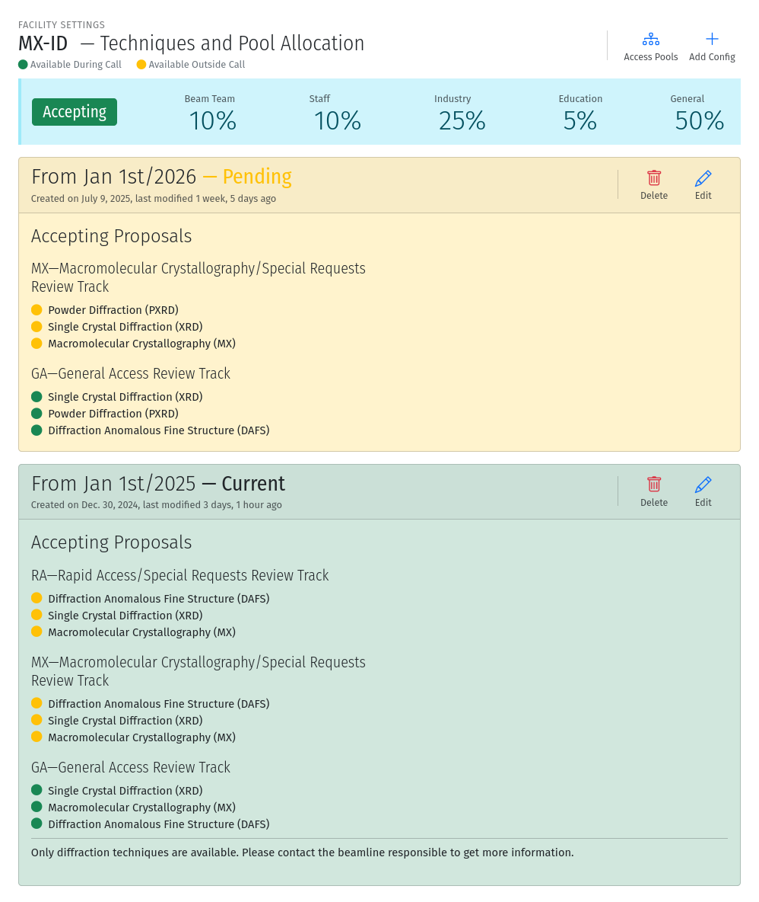
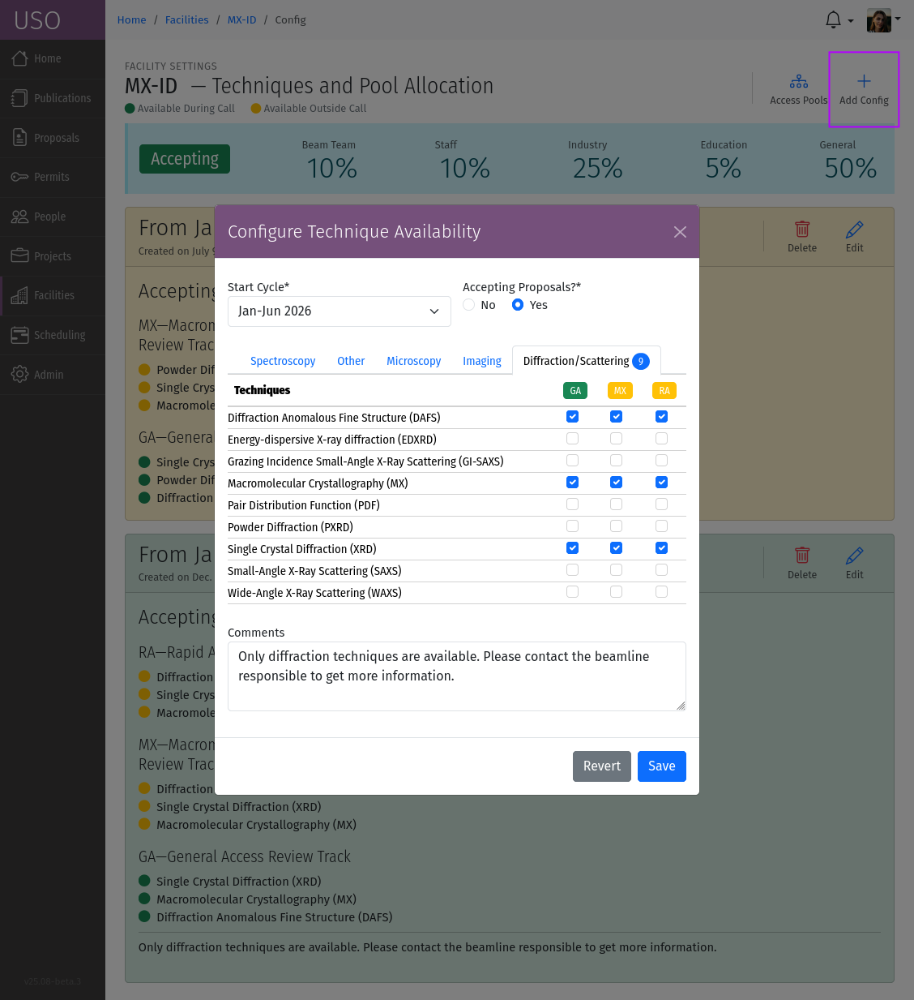
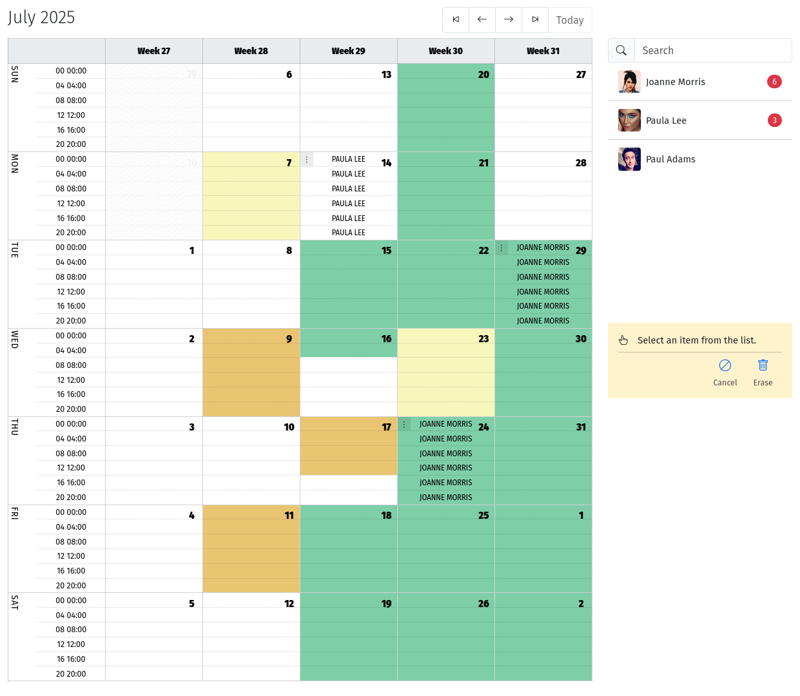
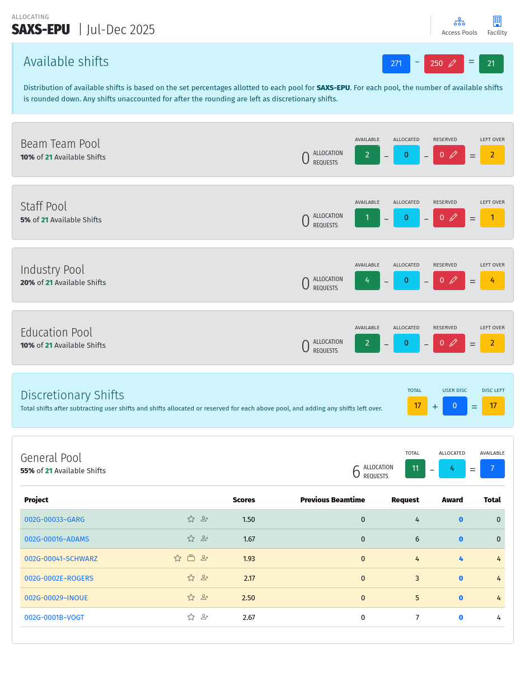

Facility Management
===================

Creating and Editing Facilities
-------------------------------
Beamlines and instruments can be created by a User Office Administrator. To create new facilities, navigate to the
:menuselection:`Facilities --> All Facilities` list page and use the :icon:`bi bi-plus;Add Facility` tool to create a new
Facility.  On the Create Facility form that appears, you can enter the details of the facility, including its name,
description, and any other relevant information:

    A screenshot of the Create Facility form with fields for name, description, and other details.

The following fields are available on the Create Facility form:

- **Name**: The full name of the facility.
- **Acronym**: The abbreviation for the facility. The acronym will be used to generate URL links, must contain
  only ASCII characters and hyphens and must be unique across all facilities.
- **Description**: A brief description of the facility.
- **Type**: The type of facility, such as "Beamline" or "Instrument". This field is used to categorize the facility.
- **Parent Facility**: If the facility is a sub-unit of another facility, you can select the parent facility here.
  This field is optional and can be left blank if the facility is a top-level facility.
- **Source Type**: The type of source used by the facility, such as "Wiggler", "Undulator", "Laser", etc.
- **Spectral Range**: The spectral range of the facility. Use this to specify the range of energies or other similar
  information.
- **Spectral Resolution**: The spectral resolution of the facility, if applicable.
- **Flux**: The beam flux of the facility, if applicable.
- **Spot sizes**: The spot sizes of the beam, if applicable.
- **State**: The current status of the facility, such as "Design", "Inactive", or "Construction", "Operating", etc.
- **Shift Size**: The minimum scheduling size of the facility in hours, "Four Hours" or "Eight Hours".
- **Allocation Required**: Indicates whether the facility requires allocation, or uses flexible scheduling and does not
  allocate shifts to projects.

Existing facilities can be edited by clicking on the :icon:`bi bi-pencil;Edit Facility` tool on the beamline/instrument detail
page. The detail page can be accessed by clicking the facility acronym in the
:menuselection:`Facilities --> All Facilities` list. In addition to User Office Administrators,  beamline/instrument
administrators can also edit the details of their facilities.

Facility details
----------------
The facility detail page provides an overview of the facility, including its name, acronym, description, and other
details. It also displays panels for the beam time sessions, and the immediate past cycle, the current cycle, and the
next two cycles, showing some statistics of numbers of projects, and shifts.

    A screenshot of the facility detail page showing the facility name, acronym, description, and cycle panels.

Using the tools at the top of the facility detail page, you can manage additional aspects of the facility, such as:

- **Edit**: This tool allows you to edit the details of the facility, such as its name, description, and other
  attributes.
- **Settings**: Used to configure techniques, review tracks and access pool allotments.
- **Projects**: the list of projects associated with the facility.
- **Publications**: the list of publications associated with the facility.
- **Proposals**: the list of proposals associated with the facility.
- **Calendar**: The facility calendar including both scheduled beam time and user support.

Within each cycle panel, various tools are available to manage the facilities relationship with the cycle. Specifically:

- **Support**: This tool allows you to schedule user support during the cycle.
- **Schedule**: Select this tool to schedule beam time to projects for this cycle.
- **Bookings**: On flexible-scheduling beamlines, this tool allows you to view and manage booking requests.
- **Projects**: This tool takes you to the list of projects associated with the facility during the cycle.
- **Allocation**: Use this tool to perform beam time allocations.
- **Submissions**: View the list of submissions for future cycles.

Facility Settings
-----------------
The facility settings page allows you to configure various aspects of the facility, such as techniques, review tracks,
and access pool allotments. To access the settings page, click on the :icon:`bi bi-sliders2-vertical;Settings` tool on the facility detail
page. At the top of the settings page, you can see the facility name, acronym, and description. Below that,
the current access pool allotments are displayed, showing the percentage of shifts available for each access pool.
You can edit the access pool allotments by clicking on the :icon:`bi bi-diagram-3;Access Pools` tool at the top of the page.

    A screenshot of the facility settings page showing the access pool allotments and tools for managing techniques,
    and access pools and available techniques.

The facility settings page also includes cards for displaying available techniques and review tracks. Changes to
the techniques and review tracks can be made by clicking on the :icon:`bi bi-plus;Add Config` tool at the top of the page.

    A screenshot of the facility techniques configuration form showing the available techniques associated tracks.

The form allows you to select the techniques and their associated review tracks. Techniques are grouped together
into tabs based on the category. Select the effective starting cycle for the change, then for each available technique,
select the review track that will be used for proposals requesting the technique. The track acronyms are indicated
as column headers, and color coded based on whether they require a call for proposals or not.
If the facility is not available during a cycle, you can answer :guilabel:`No` under "Accepting Proposals?" to
indicate that the facility will not be accepting proposals for the cycle.

Scheduling User Support
-----------------------
User support can be scheduled for the facility during the cycle. To schedule user support, click on the
:icon:`bi bi-person-plusSupport` tool for the relevant cycle on the facility detail page. This will take you to the user support
scheduling page, where you can assign facility staff member to shifts. The user support scheduling page displays a
calendar view of the shifts available for user support color-coded based on the overall schedule modes of the
organization. A sidebar on the right displays all the available staff members who can be assigned to user support.

    A screenshot of the user support scheduling page showing the calendar view of shifts and available staff members.

Select a staff member by clicking on their row from the sidebar, then repeatedly click the starting and ending shifts
to schedule a sequence of shifts to the selected staff member. Press the :guilabel:`Esc` button on the
keyboard to end a sequence. To delete a scheduled shift, click on the handle at the beginning of the shift to reveal
the :icon:`bi bi-trash;Delete` tool. Alternatively, you can use the :icon:`bi bi-trash;Erase` tool in the sidebar to delete a
region of scheduled events. The :icon:`bi bi-ban;Cancel` tool allows marking scheduled events as cancelled without
removing them from the schedule.

The total number of 8-hour blocks scheduled for each staff member for the current cycle, is displayed next to their
name in the sidebar.

.. note::
   The schedule does not currently support undo/redo operations, so be careful when overwriting the existing schedule.

Managing Bookings
-----------------
On flexible-scheduling beamlines, you can manage booking requests for beam time. To manage bookings, click on the
:icon:`bi bi-inbox;Bookings` tool for the relevant cycle on the facility detail page. This will take you to the list of
booking requests for the facility during the cycle. Clicking the entries on the list will load a modal dialog
with the details of the booking request, including the project name, requested shifts, comments, and date
preferences for the request. You can change the status of the booking request by selecting the appropriate
status from the dropdown menu. The available statuses are:

- **Draft**: The booking request has not been submitted. Use this to return the booking request to the user for
  further editing. Draft requests are not visible to staff, therefore the user must re-submit the request again.
  Only do this if you are in communication with the user about the booking request.
- **Submitted**: The booking request has been submitted for consideration.
- **In Progress**: The booking request is being processed by the staff. Use this to indicate that you are actively
  working on the request.
- **Completed**: The booking request has been processed and the shifts have been scheduled.

Scheduling Beam Time
--------------------
Beam time can be scheduled for projects during the cycle similarly to scheduling user support. To schedule beam time,
click on the :icon:`bi bi-calendar-plus;Schedule` tool for the relevant cycle on the facility detail page. This will take you to the
beam time scheduler page, where you can assign projects to shifts. The beam time scheduling page displays a calendar
view of the shifts available for beam time color-coded based on the overall schedule modes of the organization. Use the
arrows at the top to navigate to the month or week of interest. A  sidebar on the right displays all the projects
that can be scheduled beam time.

Select a project by clicking on its row from the sidebar.  If an active booking request exists for the selected
project, or if the user specified data preferences when submitting the related proposal, the calendar dates
will be highlighted with colored badges to indicate favored vs disfavored dates. Then repeatedly click the starting
and ending shifts to schedule a sequence of shifts to the selected project. Press the :guilabel:`Esc` button on
the keyboard to end a sequence. To delete a scheduled shift, click on the handle at the beginning of the shift to
reveal the :icon:`bi bi-trash;Delete`  tool. Alternatively, you can use the :icon:`bi bi-trash;Erase` tool in the sidebar to delete a
series of scheduled events. The :icon:`bi bi-ban;Cancel`  tool allows marking scheduled events as cancelled without removing
them from the schedule. Use the :icon:`bi bi-geo-alt;Reserve` tool to reserve a block of time without assigning it to a project.

.. figure:: beam-time-schedule.png
    :alt: Beam Time Scheduling Page
    :align: center

    A screenshot of the beam time scheduling page showing the calendar view of shifts and available projects. You
    can also see red or green badges indicating favored or disfavored dates for the selected project.

The total number of 8-hour blocks scheduled for each project for the current cycle, is displayed next to its name
in the sidebar.

.. note::
   The schedule does not currently support undo/redo operations, so be careful when overwriting the existing schedule.

Allocating Beam Time
--------------------
Some beamlines that require allocation, Beam time must allocated to projects after reviews are completed, typically
on the Allocation Date of the cycle. To allocate beam time, click on the :icon:`bi bi-diagram-3; Allocate` tool
for the relevant cycle on the facility detail page.  On the cycle allocation page, you will
see several sections corresponding to the
different access pools available. Each section displays the number of shifts available for allocation based on the
access pool allotments configured for the facility. Pool allotments can be configured either through the
facility detail page, or by clicking the :icon:`bi bi-diagram-3;Access Pools` tool at the top of the allocation page.  Each
facility can specify it's own allotments.

    A screenshot of the allocation page showing the available access pools and the number of shifts available for
    allocation.

The total number of shifts available for allocation is determined from the master facility schedule and the pool
percentages are used to calculate the number of shifts available for each pool. The number of shifts available
(green boxes) overall, or for each pool can be reduced further by updating the reservations shown in red
boxes. This could be used to remove shifts if the beamline is undergoing maintenance on certain dates, or based on
staff availability to provide user support.

Within each pool section, all projects eligible for allocation are listed. This includes new projects
resulting from approved submissions and projects from previous cycles that submitted renewal requests. The list shows
the project name, number of shifts requested, the aggregate review score, the number of shifts used during previous
cycles, and the number of awarded shifts. Icons may be displayed next to the project name to indicate
aspects of the project that may be of interest during allocation. For example, a Star :icon:`bi bi-star` is shown
indicate new projects. Projects from new Principal Investigators (PIs) are indicated with a Person icon
:icon:`bi bi-person-plus`,   and multi-beamline projects are indicated with a stacked card
icon :icon:`bi bi-collection`.

The projects are sorted by the review score and the table rows are color-coded based on the likelihood of allocation.
A green background indicates projects that can have all requested shifts allocated based on the number of shifts
available for the pool. A yellow background is considered the ‘decision band’. These projects have a similar score
and therefore can still be allocated a portion of their requested shifts after the top-scoring projects. The remaining
projects are unlikely to be allocated shifts unless discretionary time is used.

To allocate shifts to a project, click on the number in the Awarded column for the project and fill out the form that
pops up. Enter the number of shifts you wish to allocate to this project. On this form it is also possible to adjust
the validity period of the project. Once saved, the numbers will be updated and the allocation page will re-calculate
accordingly.