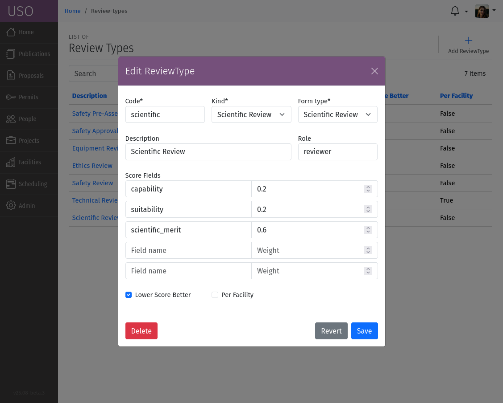
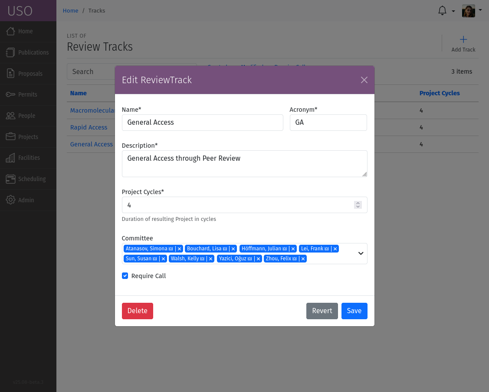
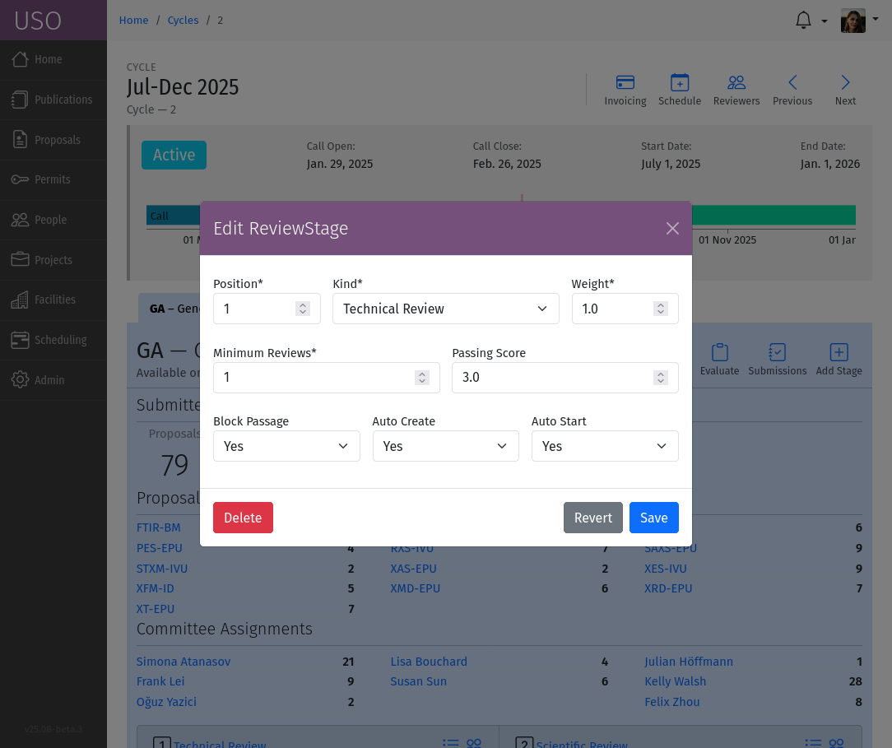

Managing Reviews
================

The review process in organized into ReviewTypes, ReviewTracks, and ReviewStages to
ensure a structured workflow. Each track represents a specific area of focus, while stages within each track
define the progression of reviews.

Review Types
------------
ReviewTypes are the fundamental building blocks of the review process. They define the nature of the review,
the criteria for evaluation, and the roles of the reviewers involved. ReviewTypes can be added/modified by
accessing the :menuselection:`Admin --> Review Types` section of the USO system menu.

    A screenshot of the Review Types form.

Each ReviewType is characterized by the following attributes:

- **Code**: A unique identifier for the review type.
- **Kind**: The type of review being conducted, such as "Safety", "Technical", "Scientific", etc.
- **Form Type**: The type of form used for the review.
- **Description**: A brief overview of the review type, outlining its purpose and scope.
- **Role**: The role of reviewers who are responsible for conducting the review.
- **Score Fields**: A list of field names and weights within the review form that are used to score the review
- **Lower Score Better**: A flag indicating whether a lower score is considered better for this review type.
- **Per Facility**: A flag indicating whether the review is conducted per facility. In this case, the role should
    preferably have a placeholder where the facility acronym will be substituted.

Review Tracks
-------------
A review track is a collection of related reviews that share a common theme or goal. Additionally, each track
can specify a set of reviewers, the committee, who are responsible for conducting the reviews. In some cases,
the track may also access a set of reviewers who are not part of the committee but are invited to participate
in the review process. Review tracks can be added/modified by accessing the :menuselection:`Admin --> Review Tracks`
section of the USO system menu. Review Track parameters can also be modified on Cycle detail pages.

    A screenshot of the Review Tracks form.

Each review track is defined by the following attributes:

- **Name**: A unique identifier for the review track.
- **Description**: A brief overview of the track's purpose and scope.
- **Committee**: A list of reviewers who are part of the committee for this track.
- **Acronym**: A short abbreviation for the track, used for quick reference.
- **Require Call**: A flag set to indicate that this track only accepts proposals during a Call.
- **Project Cycles**:  The number of cycles that projects resulting from this track are valid.

Review Stages
-------------
Each review track is divided into stages, which represent the different phases of the review process. The stages
are designed to guide the review from initial submission to final approval. Each stage specifies the type
of review that is conducted, the reviewers involved, and any specific requirements or criteria that must be met.

The details of each review stage are shown within the cycle detail page, under the relevant Review Track tab.
The tools within the Review Track tab allow User Office Administrators to manage the stages of the review track.

.. figure:: review-stage-tools.png
    :alt: Managing Review Stages
    :align: center

    A screenshot of the Review Track details under a given cycle showing review stages for the track, and
    tools for managing review stages.

Click the :icon:`bi bi-plus-square;Add Stage` tool to add a new stage to the track. Click the stage title to edit
an existing review stage.

    A screenshot of the Review Stage form.

Each review stage is defined by the following attributes:

- **Kind**: The ReviewType performed at this stage.
- **Position**: The order of the stage within the track.
- **Min. Reviews**: The minimum number of reviews required to proceed to the next stage.
- **Max. Workload**: The maximum number of reviews per reviewer for this stage.
- **Passing Score**: The minimum/maximum score that a proposal must achieve to pass this stage. Depending on the
  ReviewType, this can be a minimum or maximum score.
- **Blocks Passage**: A flag indicating whether this stage blocks the passage of a proposal to the next stage.
- **Create Automatically**: A flag indicating whether this stage is created automatically when a proposal is submitted.
- **Start Automatically**: A flag indicating whether reviews in this stage are started automatically. When a review starts,
  email notifications are sent to reviewers and the review is open and available to be completed.

Review Process Workflow
-----------------------
The review process follows a structured workflow that begins with the submission of a proposal and progresses
through various stages of review. On submission, the proposal is assigned to a review track
then the reviews for first stage are created automatically if configured as such.

Reviewers are notified of their assigned reviews, and they can access the review forms to provide their evaluations.
Once all required reviews for a stage are completed, the submission is evaluated based on the scores provided by the
reviewers, and the stage parameters are check to determine if the submission passes or fails the stage. If it passes,
or if the stage does not block passage, the submission moves to the next stage in the review track and the next set
of reviews is created automatically if configured as such. For stages that require manual intervention, User Office
Administrators can manually create the next stage reviews and/or notify reviewers manually.

.. note::
   :ref:`Background tasks <background-tasks>` are used to automate the creation of reviews and sending of notifications
   to reviewers, and many other state transitions involved in the workflow. These tasks run periodically. For review
   stages configured to require manu intervention, User Office Administrators must manually initiate the state
   transitions through tools available on the Track Stage card within the review track.