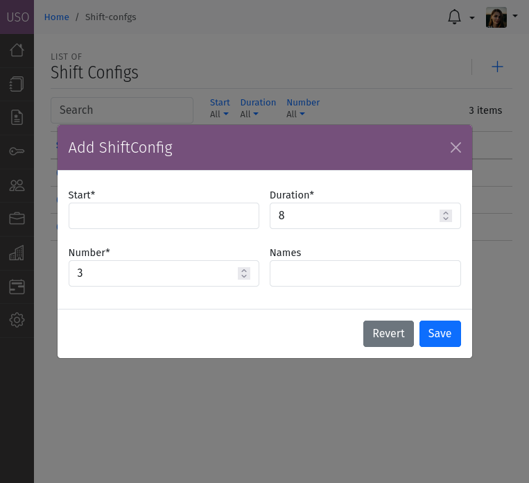
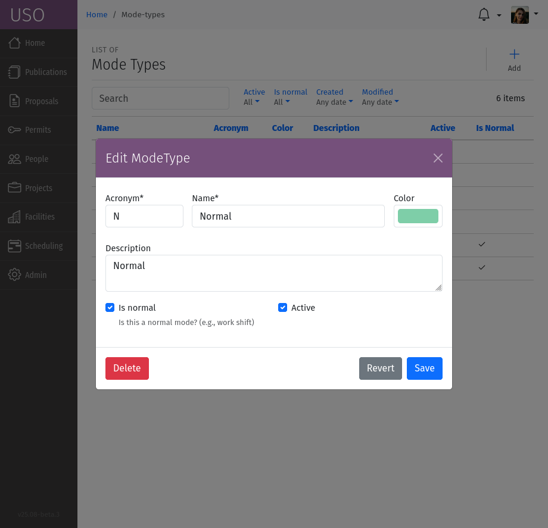
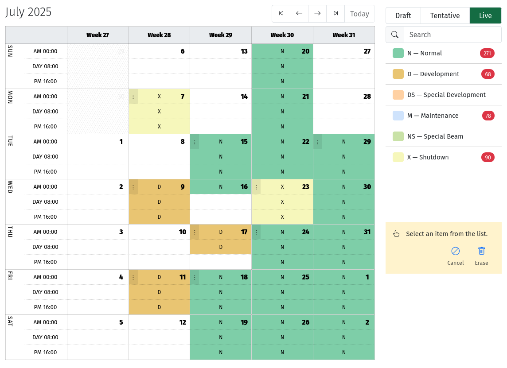

.. _schedule:

Scheduling
==========
Every cycle is associated with a schedule that spans the start-date to end-date of the associated cycle, and
forms the basis of scheduling beam time. The schedule calendar is divided up into shifts defines the time slots
available for experiments. The size and number of shifts is defined using a :ref:`Shift Configuration <shift-config>`
assigned to the Cycle Type.

.. _shift-config:

Shift Configurations can be managed by User Office Administrators through the
:menuselection:`Scheduling --> Shift Configurations` section of the USO system menu.

    A screenshot of the Shift Configuration form.

The Shift Configuration form allows you to define the following attributes:

- **Start**: Start time of the day for the first shift. `00:00` is midnight, `12:00` is noon.
- **Duration**: The length of a shift in hours.
- **Number**: The number of shifts per day. `Number x Duration` must be less than or equal to 24 hours.
- **Names**: A comma-separated list of names for the shifts. The number of names must match the number of shifts.

The Schedule also allows for overlays called **Modes** to be defined. Modes are used to define
special periods of time within the schedule, such as maintenance periods, normal operation, or other periods
of special operation.

Modes can be defined by User Office Administrators through the
:menuselection:`Scheduling --> Schedule Modes` section of the USO system menu.

    A screenshot of the Schedule Mode form.

Each mode is characterized by the following attributes:

- **Acronym**: A short abbreviation for the mode, used for quick reference, preferably 1-4 characters long.
- **Name**: A unique identifier for the mode.
- **Color**: A color code for the mode, used to visually distinguish it in the schedule.
- **Description**: A brief overview of the mode's purpose and scope.
- **Active**: A flag indicating whether the mode is currently active. Inactive modes are not used to create new
  overlays, but can be used to view historical data or for reference.
- **Is Normal**: A flag indicating whether the mode corresponds to normal operations. This is used to determine
  which shifts are marked as "available" for the purpose of allocation and scheduling.

Modes can be applied to the schedule by User Office Administrators when they edit the cycle schedule. The schedule
editor can be accessed through the :menuselection:`Scheduling --> List of Schedules` section of the USO system menu,
or more conveniently through the Cycle details page through the :icon:`bi bi-calendar-plus;Schedule` tool.

    A screenshot of the Schedule editor showing the calendar with shifts and modes.

Adding modes to the schedule is done in the same way as :ref:`adding beam time <schedule-beam-time>` or
:ref:`adding user support <schedule-user-support>`. However, the Mode Scheduler has additional options to
switch the schedule from **Draft** to **Tentative** to **Live**:

- **Draft**: The schedule is in draft mode, and can be edited freely. No shifts are available for allocation and modes
  are not visible to beamline staff or instrument managers during beam time scheduling.
- **Tentative**: The schedule is in tentative mode, and can be edited, and it's available for allocation and scheduling
  beam time but shifts are marked as tentative.
- **Live**: The schedule is in live mode, and cannot be edited. All shifts are available for allocation and scheduling
  beam time. This is the final state of the schedule, and should only be used when the schedule is finalized and ready
  for use.

If needed, the schedule can be reverted to **Draft** mode by using the buttons on the top-right corner of the
schedule editor. This will allow you to make changes to the schedule.

