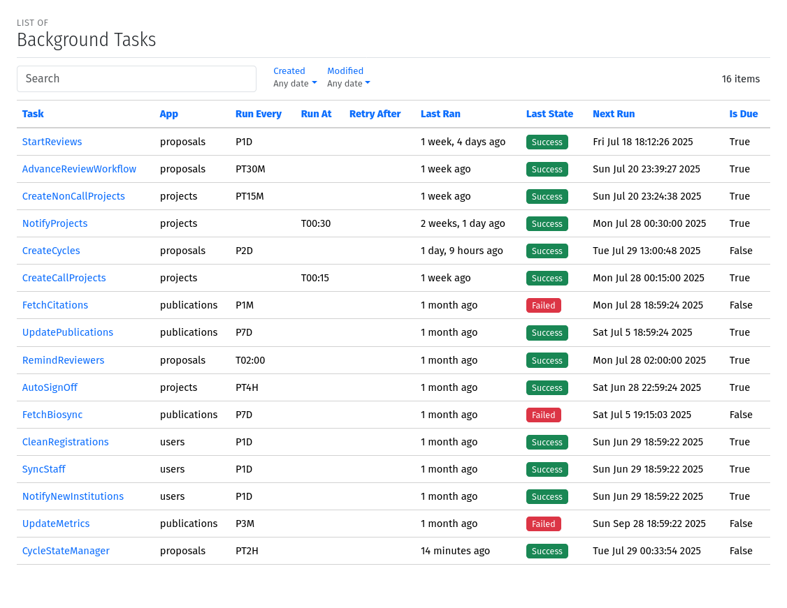
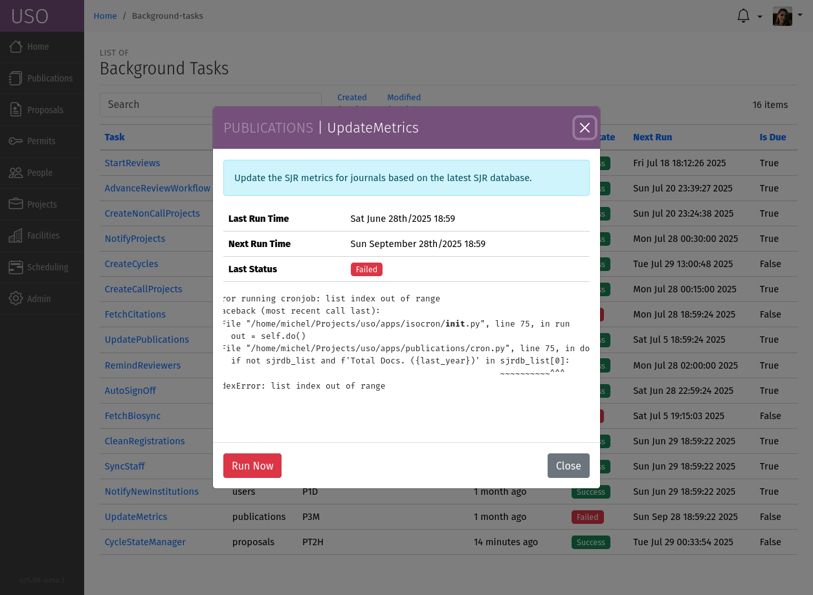

.. _background-tasks:

Background Tasks
================
The USO system relies on background tasks to manage the lifecycle of cycles, proposals, submissions, reviews, and projects.
These tasks are responsible for automatically updating the state of cycles, proposals, and submissions based on
the defined rules and schedules. Background tasks are scheduled to run periodically, ensuring that the system remains
up-to-date and that the lifecycle of cycles, proposals, and submissions is managed efficiently.

Background tasks are managed by User Office Administrators through the
:menuselection:`Admin --> Background Tasks` section of the USO system menu. This section provides an overview of the
background tasks that are currently available, their status, run frequency, the last time they ran, the log messages
from the last run, and the next scheduled run.

    A screenshot of the Background Tasks page showing the list of available tasks and their status.

To view the details of a specific background task, click on the task name. This will display the task details,
including the task description, the last run time, and the next scheduled run time. You can also view the log messages
from the last run, which can help you diagnose any issues that may have occurred during the task execution.

    A screenshot of the Background Task details page showing the task description, last run time, next scheduled run time,
    and log messages from the last run.

To run a background task manually, click the :guilabel:`Run Now` button on the task details page.

.. note::
    Running a background task manually will execute the task immediately, regardless of its scheduled run time. This can
    be useful for testing or debugging purposes, but should be used with caution in production environments. Also,
    for tasks that run based on an interval, running them manually will change the next scheduled run time, since
    run times are calculated based on the last run time.

The following background tasks are available in the USO system:

- **Cycle Lifecycle**: This task manages the lifecycle of cycles, including opening calls, starting and ending cycles
  based on the defined rules.
