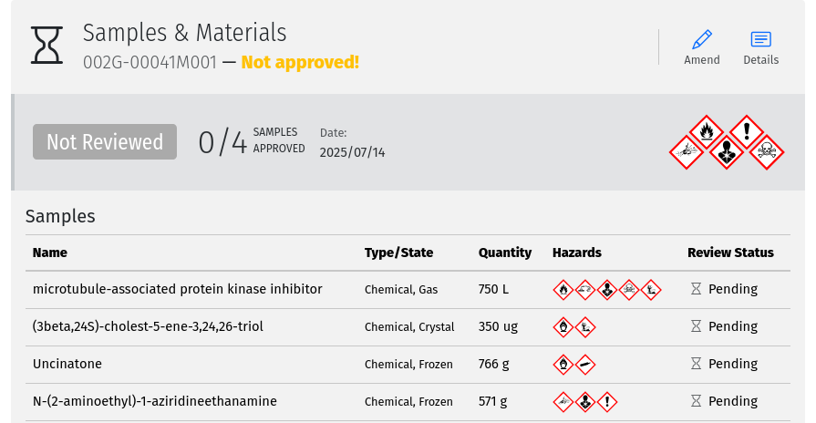
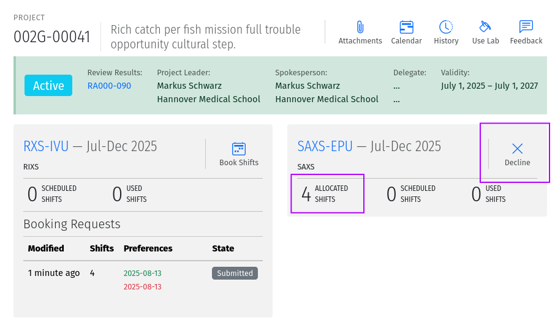
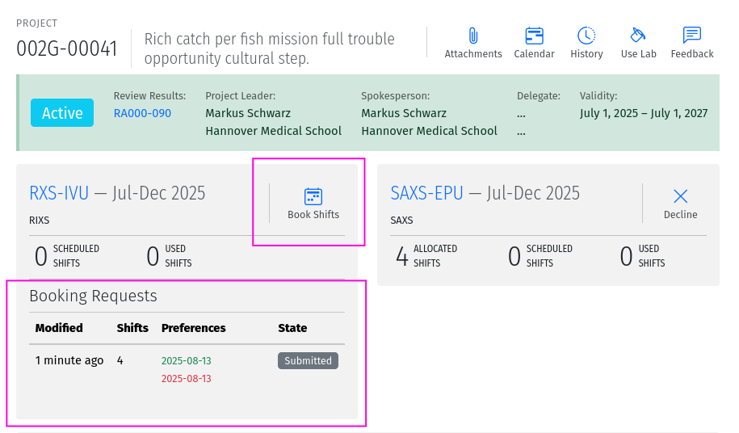
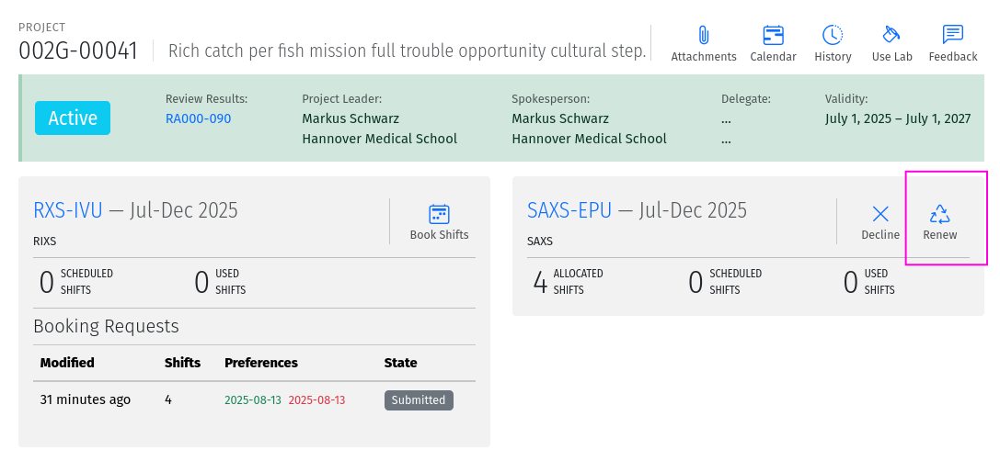
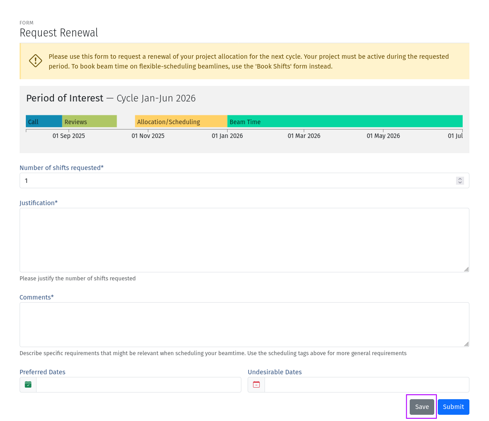
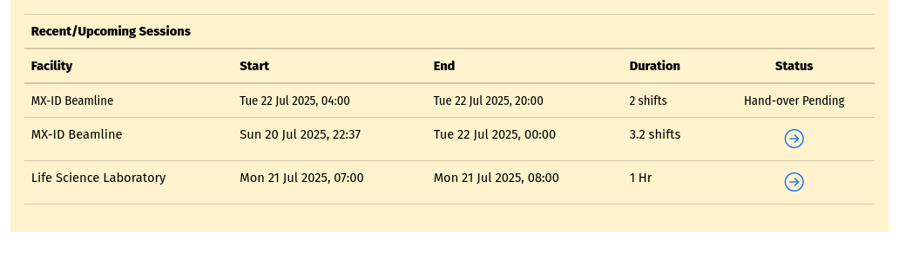
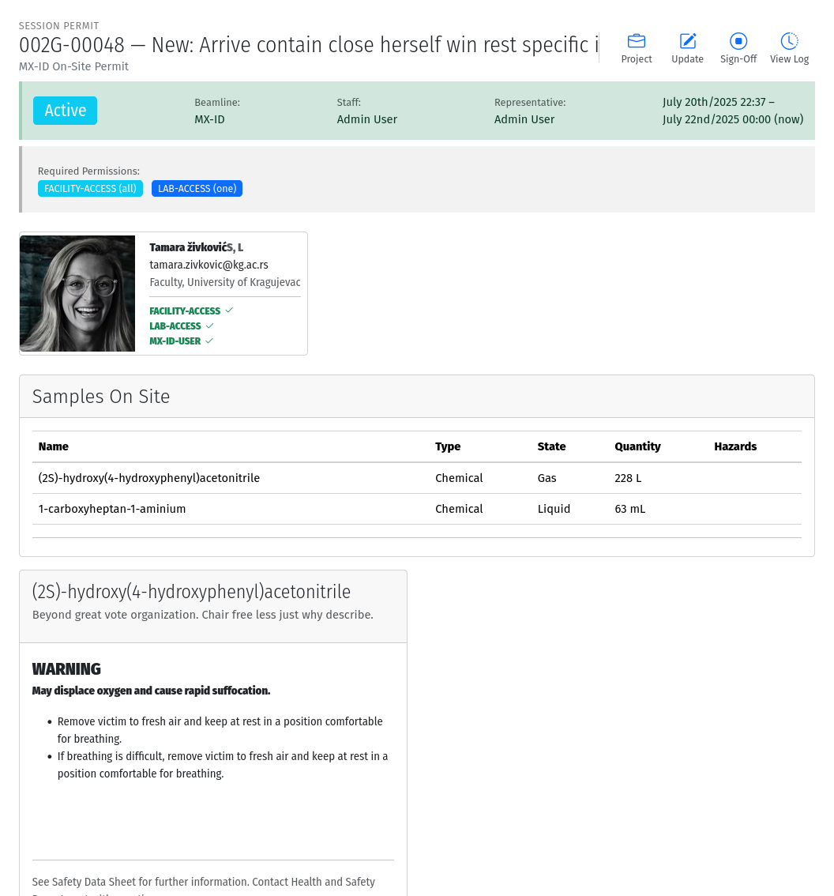

Projects
========
A proposal becomes a project when the submission is approved as a result of the review process. Only one project can
result from a given proposal, even if the proposal was submitted to multiple review tracks. Projects typically
have a time limit of validity determined by the review track. For multi-beamline proposals, it is possible to have a
situation where some beamlines are rejected while others are accepted. In this case, the project will only be created
for the accepted beamlines, and the rejected beamlines will not be included in the project.  This will be reflected by
the scores in the submission page, where the scores for the rejected beamlines will highlighted.

All project to which you are associated as a team member, are listed in the :menuselection:`Home --> My Projects`
section menu or through the "Projects" panel on the dashboard.

Materials
---------
When a project is created, it is associated with a collection of materials that the research team plans to use. These
materials include samples, equipment, ancillaries, and safety procedures related to the project. The materials are
transferred from the proposal to the project and require safety review and approval before any experiments using
them can proceed. Based on the nature of the experiments and the declared materials, additional information may be
required during the review. Safety reviewers may request clarifications or additional information during the review
and the Project spokesperson or delegate must respond to these requests within a reasonable time. Safety review
may result in approval of all the materials, only some of them, or rejection. Changes to materials can be initiated
through amendments which can be submitted at any time and will require review and approval before use. However,
amendments submitted too close to scheduled beam time may not be approved in time for your experiments.

Note that each user can manage a list of pre-defined samples which can be re-used in multiple proposals and materials.
Reviews of materials containing previously reviewed samples may be expedited.

    A screenshot of the materials overview page showing the list of samples. Amendments can be made by using the
    :guilabel:`Amend` tool.

Beamtime Allocation
-------------------
When a project is created, it is associated with specific beamlines or facilities through an allocation of beam time
on those facilities. A project can only use beamtime or be schedule if it has a valid allocation on the beamline or
facility. If a beamline is oversubscribed and the project was not allocated beam time, it will receive an allocation
of zero shifts, meaning that it was not allocated any beam time for that cycle. In this case, the project can still
be scheduled for discretional time, or request renewals for future cycle.

Some beamlines allocate beam time in advance of the cycle, while others do not. For beamlines that allocate beam time
in advance, the allocation will contain number of shifts of beam time reserved for the project on the given beamline
during the cycle. Users can decline to use the allocated beam time at any time, to return it to the pool.

    A screenshot of the allocation overview page showing the number of allocated, scheduled and used shifts and
    the :guilabel:`Decline` tool.

On beamlines (and other facilities) which do not allocate beam time in advance (flexible scheduling),
shifts are not reserved. The allocation section on the project page will therefore not show any allocated
shifts on these beamlines. Instead, beam time can be booked as needed throughout the period of validity by using
:guilabel:`Book Shifts` tool.

    A screenshot of project page showing the Book Shifts tool.

Previous bookings are shown in the table below the tool. Draft bookings are editable, allowing you save them for
submission later.

Renewals
--------
On beamlines that allocate beam time, allocations are assigned on a per-cycle basis. All active projects wishing
to be allocated beamtime during future cycle occurring within their period of validity, must renew
their allocations when the *Call for Proposals* is open for required cycle. This is the case even
for projects which got zero shifts during the previous cycle. On beamlines (and other facilities)  which do not
allocate beam time in advance, renewals are not required. Instead beam time can be booked as needed throughout the
period of validity.

Renewals are done through the :guilabel:`Renew` tool on the project page. Only one renewal can be submitted each
cycle, and it must be submitted during the *Call for Proposals*. You can save the renewal request for submission
later by using the :guilabel:`Save` button on the form instead of the :guilabel:`Submit` button.

    A screenshot of the project page showing the Renew tool.

    A screenshot of the renewal form showing the fields to fill out for the renewal request. Use the :guilabel:`Save`
    button to save your progress and return later to complete the form.

Research Team
-------------
All the individuals associated with the project and allowed to participate on the planned experiments are listed
in the research team. The team is managed by the spokesperson, delegate, or project leader. Each person on the team,
except for the spokesperson can voluntarily remove themselves from the team but only the spokesperson, the delegate,
or the project leader (if specified) can add a person to the team. Team members and changes to the team are not
reviewed but only members who meet all required qualifications will be able to participate during experiments.

The :guilabel:`Edit Team` tool can be use to add or remove team members.  All team members must be registered users
of the system. Use the :guilabel:`Update Team` tool to refresh the list of team members if any of the team
members have registered since the last update. These tools are only available to the spokesperson, delegate,
or project leader.

Permission requirements identified during safety review are highlighted in the team list. If any required permissions
are missing, the team member will not be able to participate in experiments until the permissions are granted. Some
permissions may be required on a per-sample basis, in which case, those requirements will only be enforced when
the sample is selected for use in a session. To prevent issues during the session, it is recommended to check that
all team members intending to participate have the required permissions before starting a session.

Beam Time Session
-----------------
A period of time during which a project is using a beamline/facility. A valid session requires
a few steps to establish:

* **Hand-Over**: An action performed by beamline staff to hand over a beamline to a specific project
  for a specific time slot. A hand-over is required before user experiments can start.
* **Sign-On**: An action performed by the spokesperson to assume responsibility for the beamline during
  the period prescribed period. The sign-on is only possible after a hand-over. During the sign-on,
  the spokesperson must select all participating team members and samples they plan to use during that session.
  Only approved samples may be selected. In addition, the qualifications of each team member will be verified.
  Participating team members and samples can be added at any time during the session, and beamline staff
  can extend the duration of the session at any time during the session.
* **Sign-Off**: An action performed by a team member to indicate completion of the session and confirm that
  samples have been removed from the facility. If no sign-off is performed, it will be performed automatically
  by the system and the beamline staff will be notified.

.. note::
   A successful sign-on results in a valid electronic permit to use the beamline which will remain valid
   until signed-off or terminated. Sessions can be terminated at any time by beamline or Health & Safety staff.

    A screenshot of the sessions table on the project page follow the links to sign-on or view the session details.

    A screenshot of an active beam time Session page.

Lab Session
-----------
Similar to a beamline session, except a hand-over is not needed, and it is not required to declare the samples in use.
A valid project is required in order to complete a Lab Sign-on and a valid Lab Session is required in order to use
a lab. During the sign-on process, the user selects the desired Lab, workspace, ancillary equipment, team members
and planned time slot.

.. note::
   A successful lab sign-on results in a valid electronic permit to use the lab.
