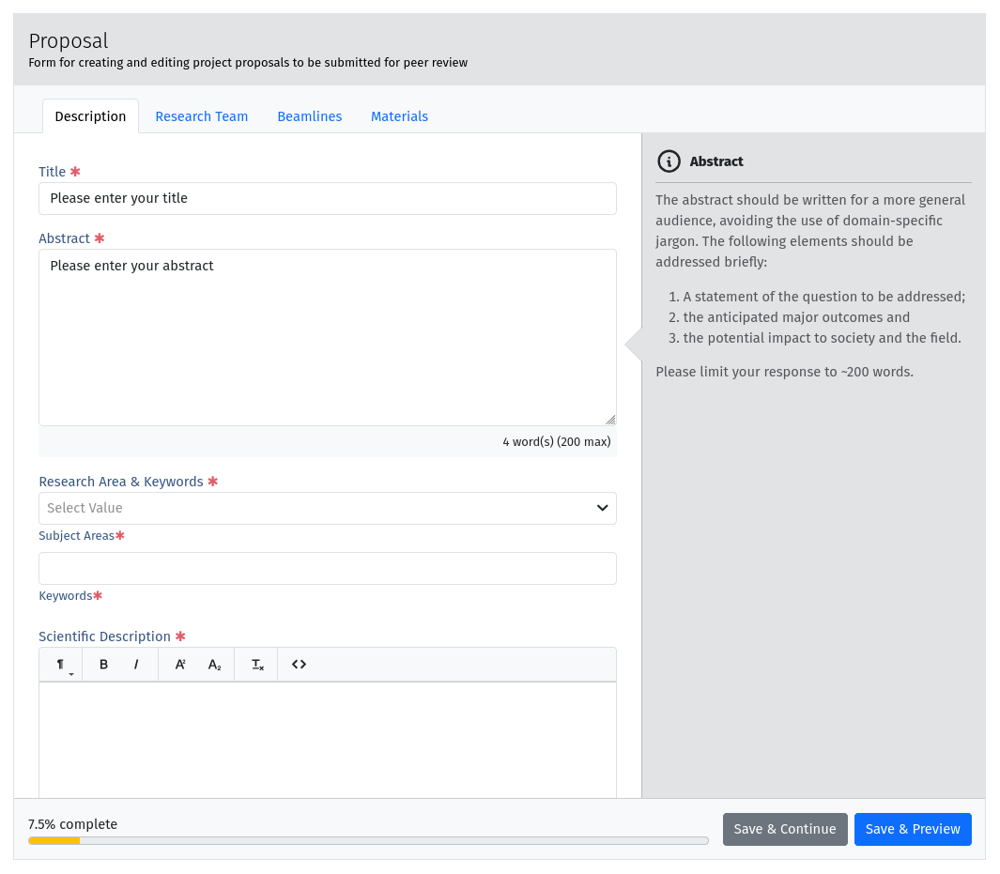
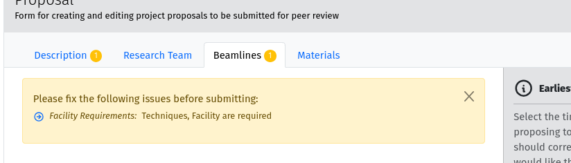
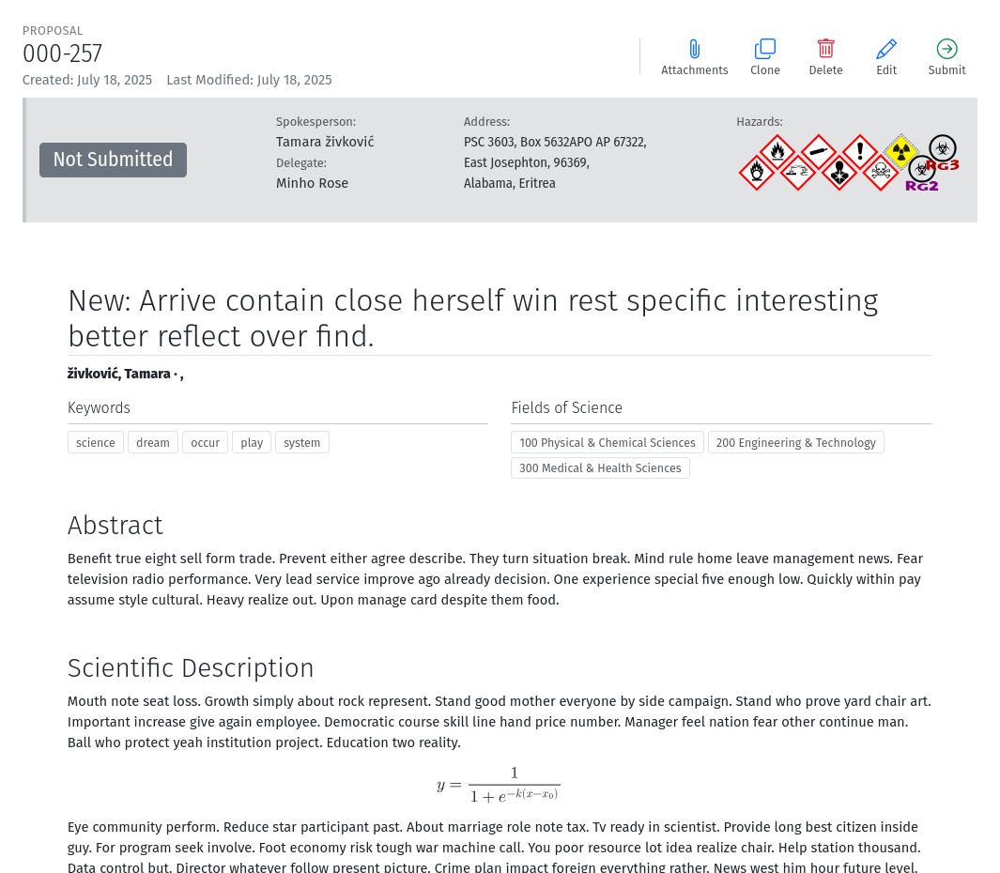
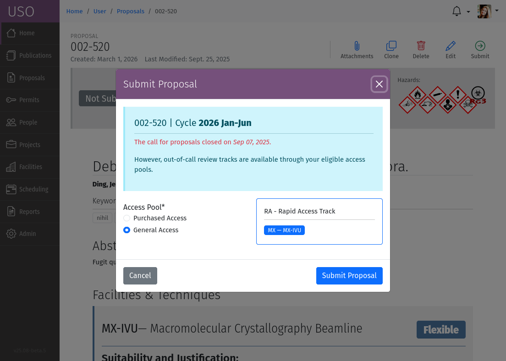
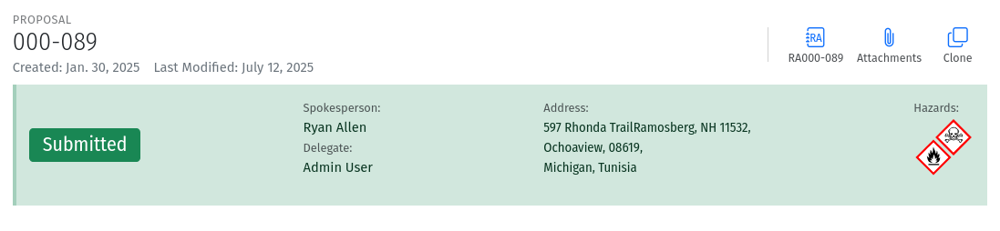

Proposals
=========

Within the USO system, proposals are the formal requests submitted by users to conduct research at a beamline or
facility. They detail the scientific objectives, expected outcomes, required resources, and list the samples and
other materials the research team will be bringing or using during their proposed experiments. This section provides
a comprehensive guide to managing research proposals within the USO system. It covers everything
from creating a new proposal to tracking its status and responding to reviewer questions.

Cycles
------
The USO system operates on a cycle-based model, typically with two cycles per year. Each cycle is a defined period
during which experiments can be scheduled and performed. However, creation and submission of proposals typically
happens several months prior to the start of the cycle, on a fixed schedule that starts with the Call-for-Proposals.
For example, for beam time scheduled starting in July, the Call-for-Proposals may occur in February of the same year
and last for about a month.  During this period users would create and submit proposals to be reviewed.

Creating a new Proposal
-----------------------
Users can create a new proposal by following the links on "Proposals" panel on their dashboard, or by clicking on
the "New Proposal" link in the "My Proposals" list page available through the :menuselection:`Home --> My Proposals`
menu. This process will open a new proposal form that collects all the necessary information about the proposed
research, including the title, abstract, objectives, and required resources, techniques, beamlines, and samples.

The proposal form is divided into several sections, each accessible through tabs at the top of the form. Each section
focuses on a specific aspect of the proposal, such as the research objectives, team members, materials, and beamlines.

   A screenshot of the proposal form showing different sections in tabs and a help sidebar.

On large screens, a help sidebar is displayed on the right-hand side of the page. Focusing on a given field loads
relevant help text for the field in the help sidebar. A progress bar at the bottom of the form indicates what percentage
of the form has been completed. The color of the progress bar will change from orange to green when the form
is valid and can be submitted. However, the form can be saved at any point, even while incomplete.
This allows users to return to the proposal later and continue filling it out. To save your progress while editing
the proposal, click the :guilabel:`Save` button. When you save your proposal, the form will be validated, and any
identified problems will be highlighted through the tabs at the top of the form, and through warnings within each
section. All highlighted issues must be addressed prior to submitting the proposal.

   A screenshot showing validation warnings in the proposal form.

Clicking the :guilabel:`Preview`
button saves the proposal and redirects to the preview page where you can see the content of the proposal in a
formatted document for reading.

   A screenshot of the proposal preview page showing the proposal content and the submit button on the toolbar.

The proposal preview page also includes a toolbar with several icons that allow you to perform actions on the proposal:

* Add an **Attachment**: This allows you to upload additional files related to the proposal, such as supporting
  documents.
* **Clone**: duplicates the proposal, creating a new proposal with the same content. This is useful if you want to
  create a similar proposal without starting from scratch.
* **Edit**: returns you to the proposal form for editing.
* **Delete**: removes the proposal from the system. Only available for draft proposals. This action is irreversible,
  and once a proposal is deleted, it cannot be recovered,
* **Submit**: submits the proposal for review. This action is only available when the proposal is complete and valid.
  Once submitted, the proposal cannot be edited, but you can respond to reviewer comments if the proposal is accepted
  or under review.

All proposals you have created, or which include you as a team member, are listed in the
:menuselection:`Home --> My Proposals` section menu or through the "Proposals" panel on the dashboard.

Submitting a Proposal
---------------------
Proposals can only be submitted from the preview page. Once the proposal form is complete, users can submit it
for review by clicking the :guilabel:`Submit` icon on the proposal preview page.
Select the appropriate ReviewTracks and Access Pool for submissions.

   A screenshot of the proposal submit form.

The proposal submit form allows you to select the review tracks for the proposal. Review tracks are predefined
categories that determine how the proposal will be reviewed. The available review tracks varies depending on the
beamline or techniques requested, and submission time. Some review are only available during specific calls for
proposals.

The submit form may also allow you to select an Access Pool for your submission. The Access Pool is a
reserved slice of beam time that the proposal will be competing for. Most proposals are typically submitted
to the default access pool, which is the general pool of beam time available for all peer-reviewed proposals. However,
based on your roles, you may have access to other pools. If this is the case, you will be able to select the
appropriate access pool for your submission.

Submissions
===========
Submissions are created when a proposal is submitted for review. Each submission is associated with a specific
review track and serve to collect all the information related to the proposal review life-cycle. When submitting
a proposal to multiple review tracks, a separate submission is created for each track.

You can access individual submissions through the links on the preview page of the submitted proposal.

   A screenshot of the proposal preview page showing the submission link.

The submission page provides an overview of the review, including its status, requested beamlines, techniques, and
number of shifts for each beamline. Once the submission has been fully reviewed, you will be able to see the
score breakdown for each stage of the review track, as well as the comments from the reviewers.  If the submission was
successfully accepted and a project has been created, you will also see a link to the project page.

Rejected submissions will not have a project link, and the review status will reflect the rejection.

.. figure:: submission-page.png
   :alt: Submission Page
   :align: center

   A screenshot of the submission page showing the review status, requested beamlines, techniques, and scores.
   A percentile rank is also shown for each stage of the review track. The rank represents the perentage of "lifetme"
   submissions that received a score lower than the current submission at the same stage. The higher the rank, the
   better the score.