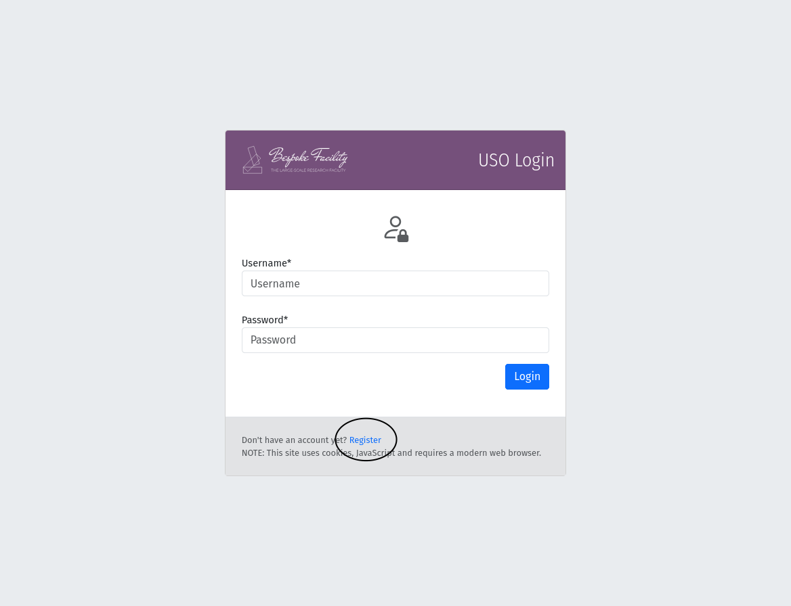
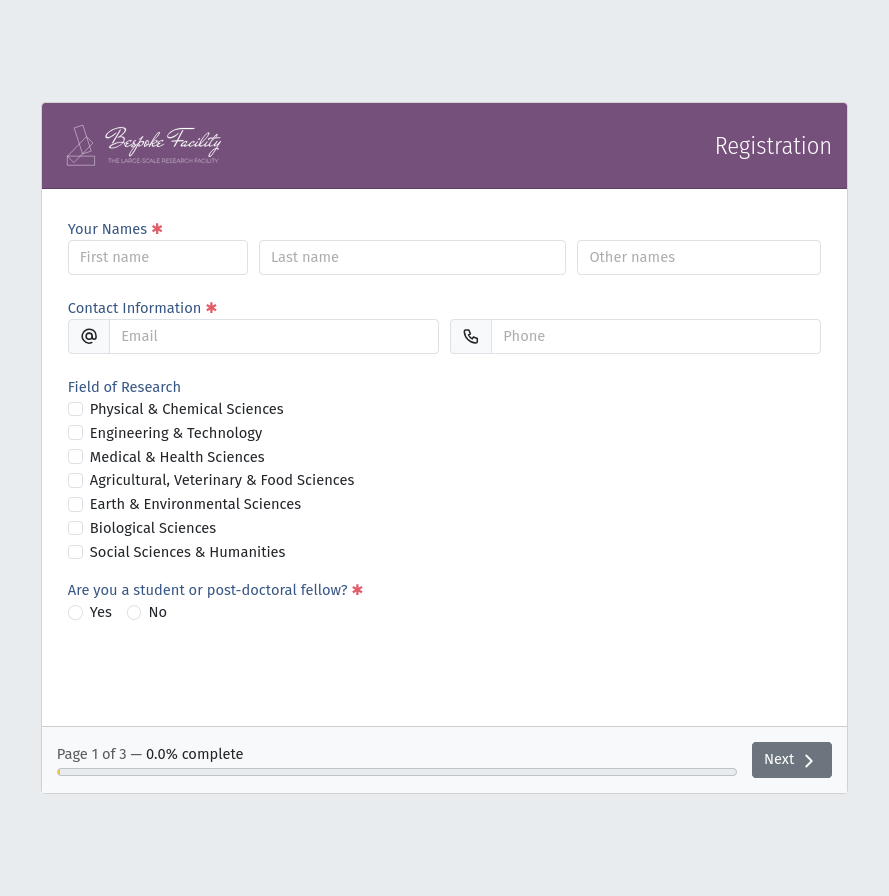
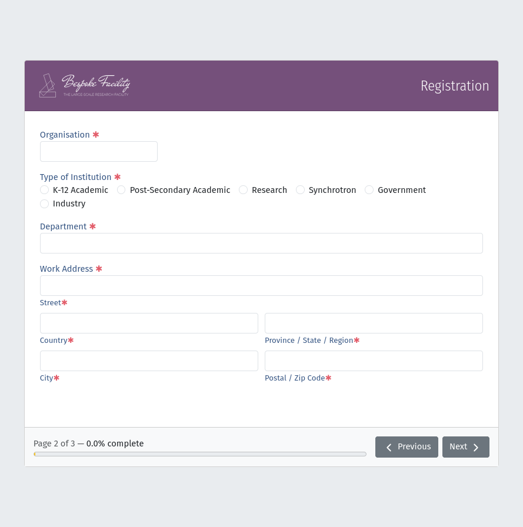
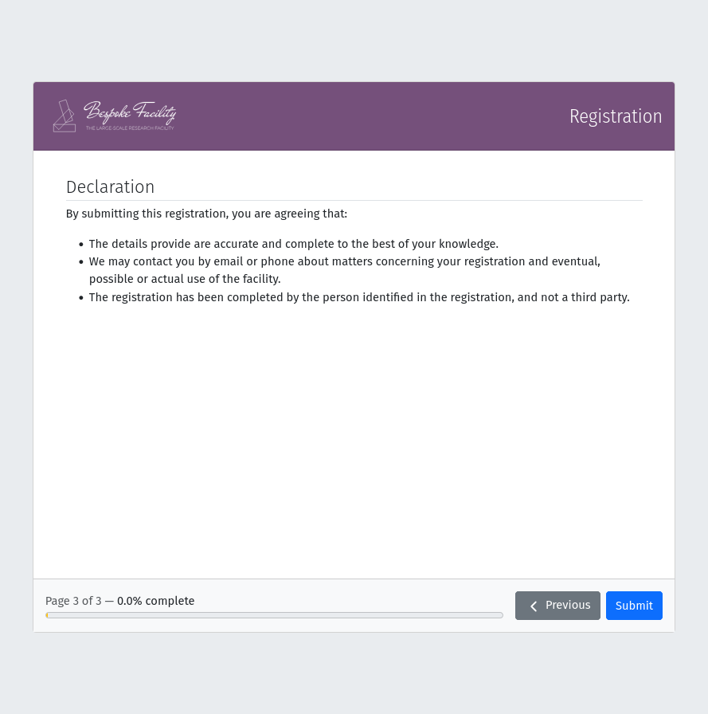
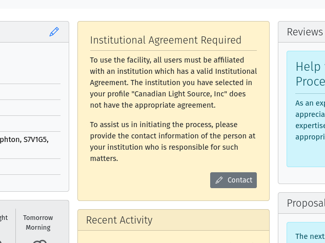
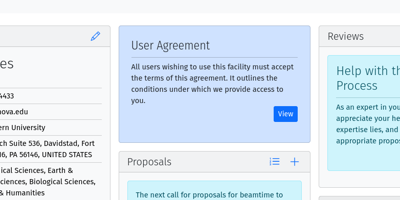
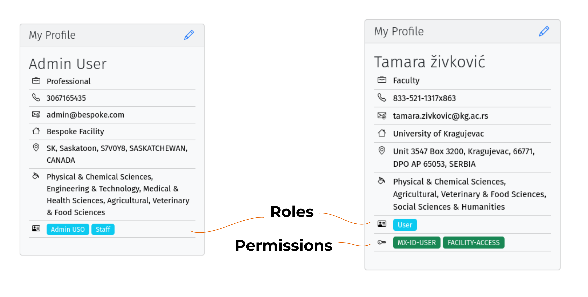

.. _user-guide:

Getting Started
===============

Registering and Logging In
--------------------------
To start using the USO system, you need to register for an account. This process typically involves filling out a
registration form with your personal and institutional information.

    The registration form can be accessed through the link at the bottom of the login form.

    Enter your personal information, including your name, email address, and field of research.

    Provide your institutional affiliation and any additional information and address details.

    Review the declaration before submitting your registration.

Once submitted, you will receive an email with  a link to confirm your registration and set your password.
After confirming your registration, you will receive another email containing your username. Use your username and
password to log-in to the system.

Institutional Agreement
------------------------
If you are registering as a user of a new institution, you may need to provide contact information for your institution
in case an institutional agreement is required. In this case, you will see a panel similar to the following on your
dashboard:

    A panel indicating that an institutional agreement is required, with a link to provide contact information.

Fill in the contact information for your institution, including the name of the contact person, their email address,
and phone number. This information will be used to facilitate the agreement process with your institution if one is
required.

User Agreement
--------------

You will also need to agree to the USO User Agreement to be able to participate in experiments.  This agreement
outlines the terms and conditions for using the USO system and participating in experiments. If a user agreement
is required, you will see a panel similar to the following on your dashboard:

    A panel indicating that a user agreement is required, with a link to review and accept the agreement.

Understanding Your Roles
------------------------
Your assigned roles are important for determining what features of the USO system are exposed to you or what actions
you are allowed to take. In almost all cases, you will only see links, menus, pages or icon-tools that you have
access to.  Roles currently assigned to you will be displayed within the "My Profile" panel on your dashboard.

    Screenshots of the "My Profile" panel for two different users showing roles and permissions as colored
    labels at the bottom.

The "User" role is the most basic role and is assigned to all users. It allows you to view your profile, manage your
account, and access the dashboard, submit proposals and manager your information such as samples, attachments, etc.
Other roles, such as "Reviewer", "Beamline Staff", or "Administrator", grant additional access to
other features of the system.

Managing Your Account
---------------------
You can manage your account information through the profile menu at the top-right corner of the header bar.
This menu provides access to various actions related to your account, such as updating your profile, changing your
password, and managing your reviewer expertise, if you are a reviewer.