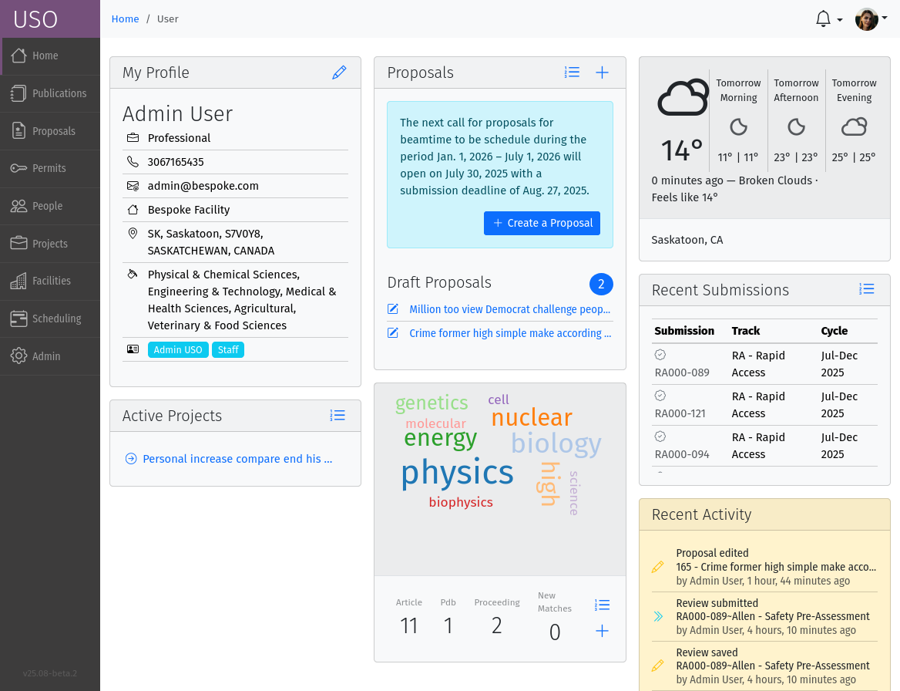

.. _user-guide:

Getting Started
===============

Registering and Logging In
--------------------------
To start using the USO system, you need to register for an account. This process typically involves filling out a
registration form with your personal and institutional information.

.. figure::
    login-form.png
    :alt: Accessing the registration form
    :align: center

    The registration form can be accessed through the link at the bottom of the login form.

.. figure::
    registration-page-1.png
    :alt: Registration Form - Page 1
    :align: center

    Enter your personal information, including your name, email address, and field of research.

.. figure::
    registration-page-2.png
    :alt: Registration Form - Page 2
    :align: center

    Provide your institutional affiliation and any additional information and address details.

.. figure::
    registration-page-3.png
    :alt: Registration Form - Page 3
    :align: center

    Review the declaration before submitting your registration.

Once submitted, you will receive an email with  a link to confirm your registration and set your password.
After confirming your registration, you will receive another email containing your username. Use your username and
password to log-in to the system.

Dashboard
----------
The dashboard is the landing page of the user and contains a number of panels which summarize various
pieces of information relevant to the current moment in time. Most of the information presented on the dashboard
can be accessed in more detail through other pages in the USO system. The specific panels visible will depend on the
user's roles. Each panel may have a descriptive header or contain relevant icon tools for performing various actions
relevant to the content of the panel.

    Screenshot of the dashboard showing the Side-bar menu with icon tools, and various dashboard cards.

User-Interface Components
-------------------------

The USO user interfaces are built from similar components and interaction relies on the same concepts
throughout.

Icon Tool
    An icon with a descriptive text to the right or underneath. Single-clicking on the tool initiates
    an action such as opening a form or a pop-up, or redirecting to another page. On
    small screens, or when more space is needed on the screen, only the icon is shown.

Side-Bar Menu
    The dark vertical area to the left of the window with multiple icon tools. Clicking
    on the items in the menu expands the menu to show a sub-menu. The specific
    items visible on your menu will depend on your roles.

Page Header
    The region at the top of the browser window is the page header.  Breadcrumbs are
    usually displayed here and provide relative navigation links relevant to the page where applicable.

Notification Area
    To the right of the header region is the notification bell which may sometimes show the number
    of unread notifications. Single-clicking on the bell reveals the list of recent notifications.

Profile Menu
    The profile menu contains links for performing actions related to the account of the currently logged-in user.
    The profile menu can be activated by clicking on the photograph at the far right of the header region.

.. figure:: profile-menu.png
    :alt: Open Profile Menu
    :align: center

    Screenshot of the open profile menu showing available actions. This include setting the display theme,
    editing your profile, or changing your password.

List Page
    A list page, is a page which presents a table objects (eg, lists of samples, proposals, projects, etc).
    List pages enables users to view all entries in table format, search through them, sort and order them
    based on different fields (or columns) and filter them based on status, or other properties such as
    modification date. It may sometimes be possible to add new entries from the list page. In some cases,
    single-clicking on a row of the table redirects access to the detailed page for the selected item, or
    presents a form to allow editing the details of the selected item. All list pages follow the same
    paradigms and often contain a search box, list filters, item counts, list tools, a list header, and
    pagination tools.

    .. figure:: proposals-list.png
        :width: 800px
        :align: center
        :alt: List Page

        Screenshot of the proposals List Page.

Detail Page
    A detail page is a page which presents information about a specific item in the system (eg. Proposal,
    Submission, Project, Session, Beamline etc). Detail pages also follow the same paradigms and often contain
    a header region, a tool area, a status area and a content area. The content area may vary significantly from
    one object type to another and may also vary based on the state of the object. The status area may
    have a colored background which provide visual cues about the state of the object.

    .. figure:: beamline-detail.png
        :width: 800px
        :align: center
        :alt: Beamline Detail Page

        Screenshot of a Beamline Detail Page.

    .. figure:: project-detail.png
        :width: 800px
        :align: center
        :alt: Project Detail Page

        Screenshot of a Project Detail Page.

* **Dashboard Overview:** A tour of the main user dashboard, widgets, and navigation.
* **Understanding Your Role:** Explanation of user roles and what they mean.
